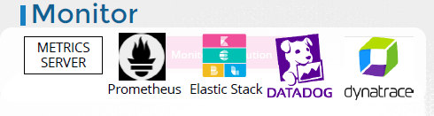

- 
- check more  on admin course
--- 
## metric Server
- `heapster` is depreated. now came as `metric Server`
  - in memory analytic
  - does not store on disk
  - hence cannot check history on analytics.
- `kubelet` has `C-advisor`, responsible to receiver performance data of date and send to metric-server
- run:
  - 

- commands:
  - k top node
  - k top pod