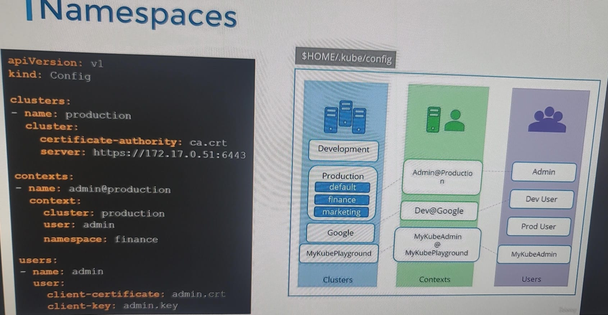

# kubeConfig File
- read by `kubectl` cmd.
- this file, present at` $HOME/.kube/config` (default file)
  - view file : **kubectl config view**
  - can setup/use custom file --> kubectl .... **--kubeconfig=new-file**
- has 3 section
  - `1. cluster` : 
    - --server my-kube-playground:6443 (**cluster-1**)
    - --certificate-authority cacert.crt
  - `3. context`  --> which user will connect to which cluster, that mapping
    - **admin_1** will connect to **cluster-1**
  - `2. users` : admin_1
    - --client-key            admin_1.key
    - --client-certificate    admin_1.crt
  - Note: above 4 option/s --xxxx, get attached to every kubectl command we make.

## ScreenShots
- 
- add more entries for other clusters and users
  - 
  - there are 3 contexts, make one default.
    - after `kind`, add `current-context: dev-user@google`
- can also define `namespace` in context:
  - 
- `certificates`
  - can put base64 encoded certificate data, as well. Rather than filepath.
  - 

--- 
## Commands
- kubectl config **view**
- kubectl config **use-context** prod-user@production-cluster 
  - this will update `current-context` feild.
- kubectl config -h
  - 
