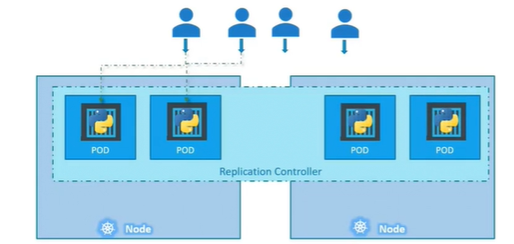
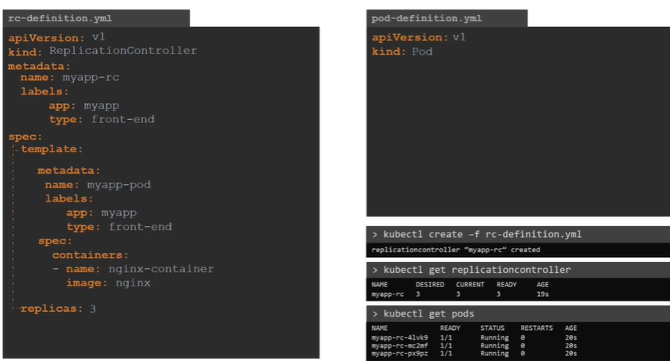

## A. replication Controller
- `replicationController` is a older way
- `ReplicaSet` is a new way, with some diff.
- makes sure specified number of pods running all the time.
- span across node/s
  - 
- yml (spec)
  - replicas : 3
  - nest the pod file in `template` section
  - it manages only pod defined in template
  - 
  - 

---

## B. Replica Set
- concept and yml --> almost same.
- it also manages pods, not defined in template section.
- thus having `spec.selector` (mandatory)

```
...
...
spec:
    ...
    ...
    selector: 
        matchLabels:
            type: front-end

## Some commands:
- kubectl get replicaset
- kubectl create -f <yaml>
- kubectl scale --replicas=6 -f replicaSet-definition.yaml
- kubectl scale --replicas=6 replicaset replicaset-1
- kubectl delete replicaset rs-1
    - all linked pods will be deleted.
-  kubectl get replicaset -o yaml > sample.yaml

Note: use rs

```
### label and selector


---

