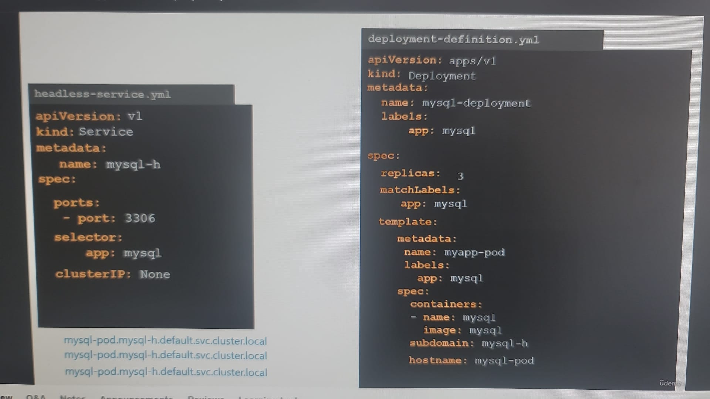
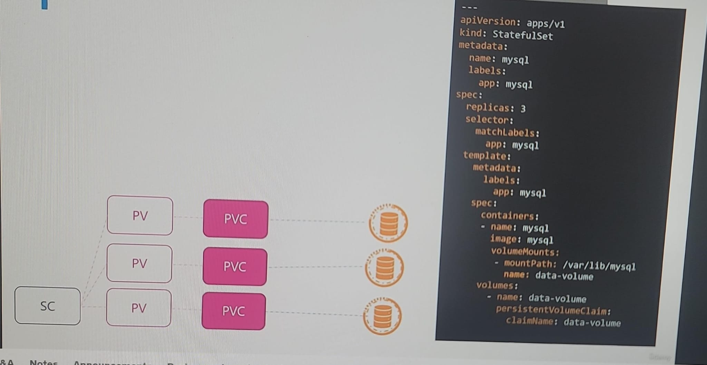

# StatefulSet
- additional points:
  - pod come up sequentially / **ordered** by default.
    - spec > `podManagemnetPolicy : OrderedReady` (default)
    - change to `Parallel`, if needed.
  - no random pod name, each pod has **ordinal-index** at end.
  - first pod is always `MASTER`
  - same like Deployment. Replace `Deployment` with `StatefulSet`.

---  
## headless service ( **optional** )
- scenario: mysql-pod-0 MASTER `(R/W)`, mysql-pod-1 (R), mysql-pod-2 (R) - write happen only from MASTER.
- create regular service with `ClusterIP: None` +  ( selector and ports ). eg: mysql-h
- headless service, creates DNS a-record to access pod only if:
  - add `subdomain` and `hostname` for pod are present., adding **manually** bad. All ns will be same.
  - rather add  `serviceName` in StatefulSet, it automatically assigns subdomain(mysql-h) and hostname(mysql-index) for pod/s (better).
  - 
  - 
- dns 
  - headless-service (No ClusterIP): **pod-1**.service-1.namespace-1.svc.cluster.local   
  - service (clusterIP): service-1.namespace-1.svc.cluster.local
  
- example : mysql-pod (DB replica)
  - 

---
## volume
### all pod needs common
- 

### separate volume for each pod.
- add `volumeClaimTemplate` in statefulSet.  (outside spec)
  - inside section is PVC only.
- if pod goes down, new pod will be attached to **same** PVC. thus stable storage.
- 