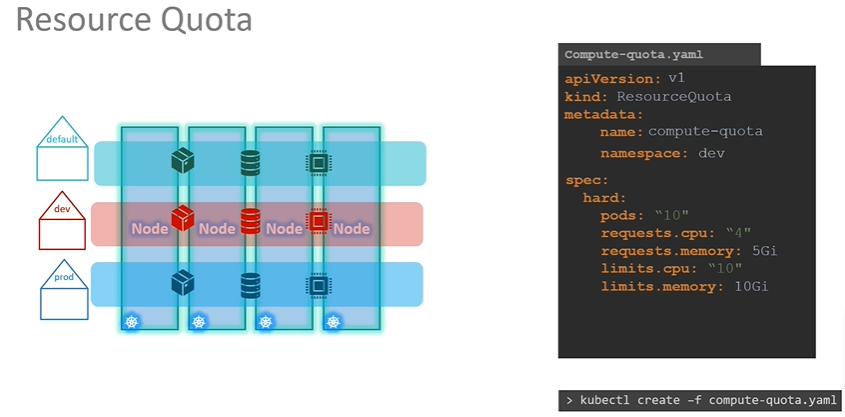

## Resource Quota

```
apiVersion: v1
kind: ResourceQuota
metadata:
  name: quota-1
  namespace: dev
spec
  hard: 
    pods: "10"
    requests.cpu : "4"
    requests.memory : "5Gi"
    limit.cpu : "10"
    limit.memory : "10Gi"
    
    
kubectl create -f yaml    
```

