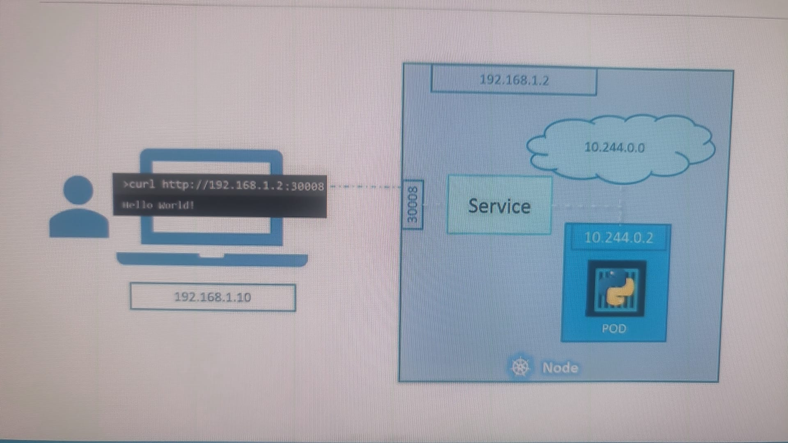
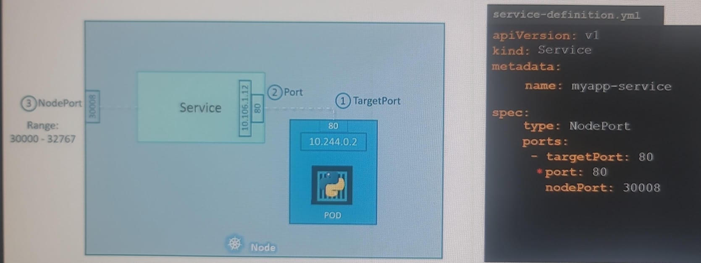

## Services
### ClusterIP:
- Exposes the service internally within the cluster. 
- default 
- Accessible only within the cluster via a stable IP.
- enables loose coupling between pod/microservices
- 

---
### NodePort:
- external-client --> internet --> k8s-cluster [  node-1[external-ip:node-port] > service-1[internal-ip:service-port] > pod/s[internal-ip:target-port]  ]
  - maps `port-on-Node` to `pod`::container::process(port)
  - listens traffic on node-port and forward traffic to pod.
  - Can be accessed externally using `<NodeIP>:<NodePort>`.
  - 
  - 
    - note: cloud-logo with 10.244.0.0, represents internal-network, here.
  - multipod service
    - 
    - 
    - span over multiple nodes

---
### LoadBalancer:
- Routes traffic to the backend pods through the cloud provider’s load balancerr.

---
### headless service:
- allows direct access to individual pod IPs without a load balancer or cluster IP. 

- Key Features:
  - `clusterIP: None`
  - `DNS-based Pod Discovery`:
    - Each pod gets its own DNS entry, useful for stateful applications where each pod has a unique identity 
    - (e.g., databases like Cassandra or StatefulSets).
  - `Direct Pod Access`:
    - Clients connect to pods directly, without load balancing.

- Use Cases:
  - `Stateful` applications (e.g., databases) that require direct access to specific pods.
  - Service discovery for applications that need `pod-level DNS` (e.g., my-headless-service-0.my-headless-service).
- This approach offers more control over **pod communication** compared to standard services.