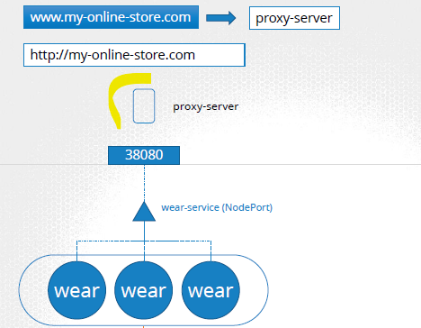

## Demo
- K8s Cluster has : 
- `app-1` : online shop - **deploymnet-object-1**
  - 
  - access:
    - with nodeIp:port
      - 
    - with proxy
      - 
    - with `loadBalancer-service-1` + `gcp-lb-1`
      - 

- `app-2` : video-stream app - **deploymnet-object-2**
  - deploy it same cluster, as new deploymnet object
  - access : with `loadBalancer-service-2` + `gcp-lb-2`

- add `gcp-lb-3` --> forward/route traffic to  gcp-lb-1 or gcp-lb-2
  - routing rules:
    - /apparel --> gcp-lb-1
    - /video --> gcp-lb-2
    
- Next, add security. but where ? (best place,  having less maintenance)
  - **SSL** 
  - **firewall rule**.
  - best place: 
    - add at app-1/2 level : problem , if application grows
    - add at proxy / gcp-lb-1/2/3 level
    - `k8s ingress`
---  

## INGRESS
- Another k8s object, think of as Layer-7 load balance where :
  - will add routing rule, to forward traffic to multiple k8s service/s
  - will add SSL
  - will add firewall
  - thus, simplfies all such config at central place.
- 
- like pod, expose ingress with service NodePort / loadBalancer <<<
  - 

- ingress object components:
  - 
  - `ingress controller`
    - proxy server, for routing / forwarding
    - need to deploy this server, does not come by default
    - eg: `nginx server` : deploy at as another pod.
      - 
      - also create **configmap** for configuration for Nginx like live-log path,etc
  - `ingress resources`
    - SSL
    - firewall
  