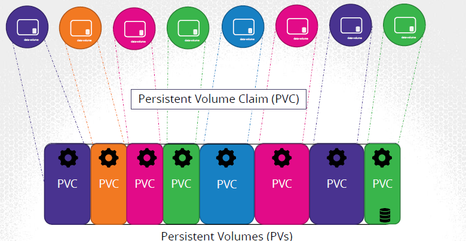
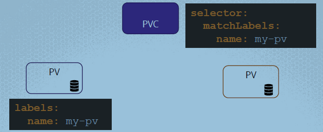
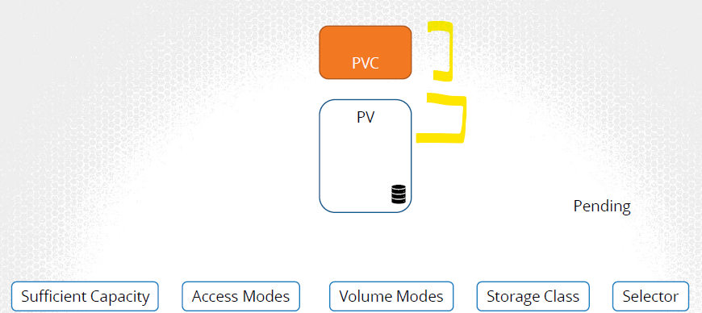

# A. Volume (in pod)
- by-default popd are `transient`. data get deleted.
- persist data processed by the containers
- retaining data it permanently. Even if the container is deleted.
- 
- **volume Types**:
  -  `emptyDir` - Temporary storage created when a pod starts, Deleted when the pod is terminated
  -  `nfs`: Mounts a remote NFS server directory into the pod.
  -  `awsElasticBlockStore / gcePersistentDisk / azureDisk`
  -  `csi` : third-party storage providers to integrate with Kubernetes
  - `hostpath` - mount File or directory from the host node's filesystem into a pod
  - 
  
```
apiVersion: v1
kind: Pod                       <<<<<
metadata:
    name: 
spec:
    containers:
    - ...
      volumeMounts:
        - mountPath: /opt
          name: data-volume

    volumes:                    <<<<<< CONFIGURED VOLUME WITHIN POD
    - name: data-volume
      hostPath:                 # source-1 - Node local dir
        path: /data
        type: Directory
      ---- OR ----
      awsElasticBlockStore:     # source-2 - aws EBS
        volumeID: 
        fsType:   
```
---
# B. Central Volume 
- 
## PV - Persistent Volume
- having multiple pod, then maintain storage `centrally`
- and carve out part of to each pod(if  needed) using `claims` (PVC)
- usually admin creates PV. and user creates PVC
```
apiVersion: v1
kind: PersistentVolume
metadata:
    name: pv-vol1
spec: 
    accessModes:   # how to mount
    - ReadWriteOnce  # ReadOnlyMany,  ReadWriteOnce,  ReadWriteMany
    capacity:
        storage: 1Gi
    hostPath:                   # source-1
        path: /tmp/da
    ---- OR ----    
    awsElasticBlockStore:       # source-2
        volumeID: 
        fsType:
    ---- OR ----    
    azureDisk:
        ...    
```
---
##  PVC - Persistent Volume claims
- **request** for binding to storage/PV based on :
  - capacity
  - accessMode/s
  - volume Modes
  - storage class
  - labels and selectors.
- `1-to-1` b/w PV and PVC
  - once a PV is bind
  - then no other PVC will get bind to that PV>
- smaller PVC  can get binded to  big PV (if thats the only match)
- state: `pending` + bind
- delete PVC, PV is retain (by default). even data.
  - `pesistentVolumeClaimPolicy: Retain` # Delete and recycle(retain but scrap all Data)
- definition:
  - we don't define binding in definition
  - it just finds matching one at runtime. <<<<
    ```
      apiVersion: v1
      kind: PersistentVolumeClaim
      metadata:
          name: myclaim
      spec:
        accessModes:
          - ReadWriteOnce
        resources:
          requests:           <<< request
            storage: 500Mi
            ...
            ... 
    ```

- Next, **use it** inside - `pod, deployment and RS object`
  ```
  # pod,RS,D object:
  spec:
     ...
     ...    
     volumes:
     - name: mypd
       persistentVolumeClaim:
         claimName: myclaim
  ```
- Screenshots:
  - 
  - 
  - 
  - 