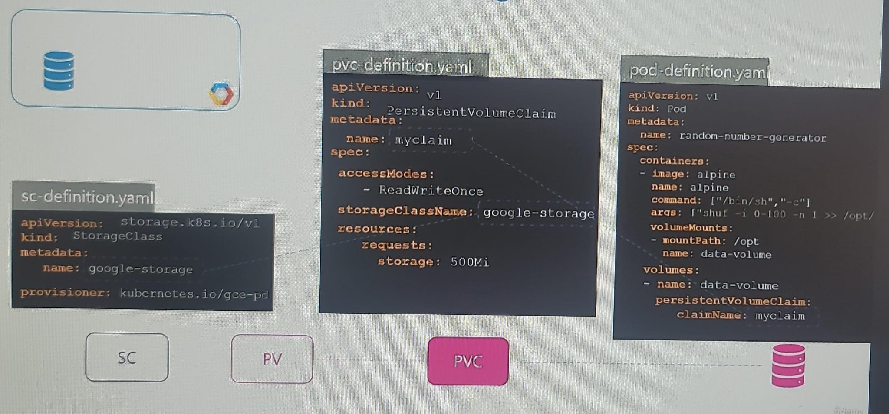

## Storage class
- `static` provisioning
  - specify PV first. Storage created ahead of time with static config
  - then define PVC
    - if matches then get bind
- `dynamic` provisioning
  - define storageClass/SC with parameter
  - then define PVC
    - PVC will use SC to provision needed storage.

- with Storage-Class can define  `Dynamic Storage provisioner`
```
apiVersion: v1
kind: PersistentVolumeClaim
metadata:
   name: myclaim
provisioner: kubernetes.io/gce-pd   
```
---
## Screenshots
- static
  - 
- dynamic
  - 