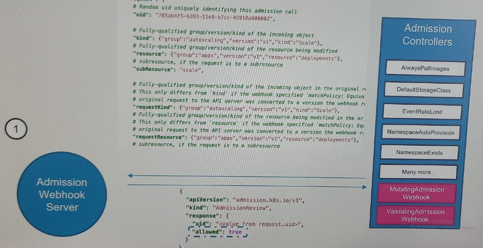
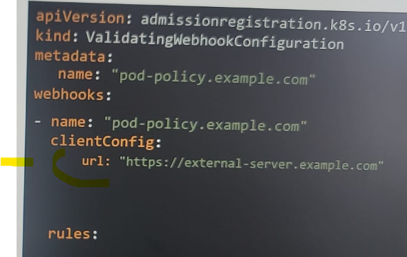

# Admission Controller
## concept
- kubectl --> kube-apiserver --> ? > ? > ? > create pod
- kubectl --> kube-apiserver --> `authentication` --> `Authorization` --> **additional actions**  --> create pod
  - use Admission controller for more security measures.
  - use built in or create your own.
- **additional actions**:
  - allow/deny request 
  - validate configuration 
  - perform operations 
  - can change can the request itself.

- example for additional task:
  - 

---
## A. enabled or disabled
- enabled or disabled on the API server, via the `--enable-admission-plugins` flag
  - **kube-apiserver -h | grep enable-admission-plugins** : wont work, try below.
  - **k exec kube-apiserver-controlplane -n kube-system -- kube-apiserver -h | grep enable-admission-plugins** *
  - **ps -ef | grep kube-apiserver | grep admission-plugins**
  - edit:
    - kube-apiserver.service
    - /etc/kubernetes/mainifests/kube-apiserver.yaml * --> when we update this file, it take few to restart.so wait.
    - 

---
## B. some built-in  Admission Controller

- `NamespaceLifecycle` :  
  - preventing creation of resources in non-existent
  - make sure  ns - `default, kube-system and kube-public` cannot be deleted.
- `NamespaceAutoProvision` **deprecated** : creates ns if not exists.
- `NamespaceExists` **deprecated**
- `LimitRanger` :  Enforces limits and resource requests on Pods and Containers within a namespace
- `ResourceQuota`: 
- `ServiceAccount` : Automatically assigns a default service account to Pods that do not specify one.
- `DefaultStorageClass` :  Assigns a default StorageClass to PersistentVolumeClaims (PVCs)
- `NodeRestriction` : restricting kubelets to modifying resources associated with their own node.
  - usually disabled
- `EventRateLimit` : Limits the number of event objects a single source can generate in a given timeframe

---
## C. Types
### C.1 updating/mutating Admission Controller
- runs first,  (before validation   Admission Controller )
- change/update object yaml/description before creating.
- eg: `DefaultstorageClass`, `NamespaceAutoProvision`
  - it updates PVC object : add `storageClassName: default`. was **initially not present.**
  - 
  - inspect after creation, `k describe pvc myclaim | grep StorageClass`

### C.2 validating Admission Controller
- allow or deny create|edit|delete requests.
- eg:  `NamespaceExists`, `NamespaceLifecycle`

---
## D. external Admission Controller / AdmissionHook
- custom-built, with own validating and mutating logic.
- 2 in-built Admission Controller present to support this.
  - `MutatingAdmissionHook`
  - `ValidatingAdmissionHook`
  - 

- Steps:
  - 1 create `webhook app` 
    - with 2 **POST** REST api `/validate` and `/mutate. `
    - create in any language. py,java, node
    - follow request / response json format. check official doc.
  - 2 Next, deploy this webhook app 
    - inside k8s cluster as pod and svc. 
    - Or, external server.
  - 3 next, create  configuration objects 
    - **validation**WebhookConfiguration / **Mutating**WebhookConfiguration object.
    - has `connection detail` to webhook app.
    - has `rule/s,` when to call these webhook api.
    
- screenshots for more understaning:
  -  
  - 
  - 
  - 