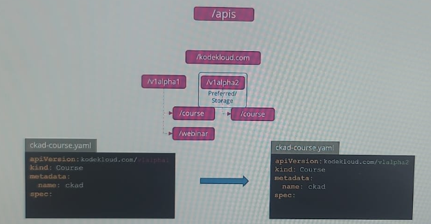

## API Version
- `apiVersion:` api-group/api-version
- alpha, beta and stable
- check:
  - **kubectl api-versions**
  - **kubectl api-resources**
  
- k8s supports multiple version. handle multiple version:
  - `preferred`
    - typically the latest stable version of that resource.
    - eg: apps/v1 for deploymnet.
  - `stored`
    -  version in which Kubernetes stores resource data in its etcd database, internally.
- enable version. eg:
  - kube-apiserver.yaml --> add `--runtime-config=rbac.authorization.k8s.io/v1alpha1`
---
## API Deprecations rules
### rule-1
- API element may only be removed, by incrementing the version.
- 
- in yaml it can be still **alpha1**, but internally it switch to **alpha2**.
- since **alpha2** is `preferred` and `stored` version.

### rule-2
- API version must be able to round-trip in given release without information loss.
- 

### rule-3
- older version must be supported  for some duration
  - `GA/stable` - 12 months or 3 releases
  - `beta` - 12 months or 3 releases
  - `alpha` - anytime deprecate.

### rule-4
- v2 just now came and released in current release. 
- then it can be become preferred/stored.

### rule-5
- **v1**-Alpha1 > v1-Alpha2 > V1-beta1 > v1-beta2 > `v1`
- **v2**-Alpha1 > v2-Alpha2 > V1-beta1 > v1-beta2 > `v2` > after this can deprecate ``.

---
- eg:
  - 
  - 

---
## `Kubectl Convert`
- install this utility first. check official doc.
  - https://kubernetes.io/docs/tasks/tools/install-kubectl-linux/#install-kubectl-convert-plugin
  ``` 
  - steps (linux)
    - curl -LO "https://dl.k8s.io/release/$(curl -L -s https://dl.k8s.io/release/stable.txt)/bin/linux/amd64/kubectl-convert"
    - curl -LO "https://dl.k8s.io/release/$(curl -L -s https://dl.k8s.io/release/stable.txt)/bin/linux/amd64/kubectl-convert.sha256"
    - echo "$(cat kubectl-convert.sha256) kubectl-convert" | sha256sum --check
    - sudo install -o root -g root -m 0755 kubectl-convert /usr/local/bin/kubectl-convert
    - kubectl convert --help
  ```
- **kubectl convert -f old-file.yaml --output-version apps/v2** --> it will priny new converted yaml file.
  - eg:  k convert -f ingress-old.yaml --output-version networking.k8s.io/v1 > ingress-new.yaml
