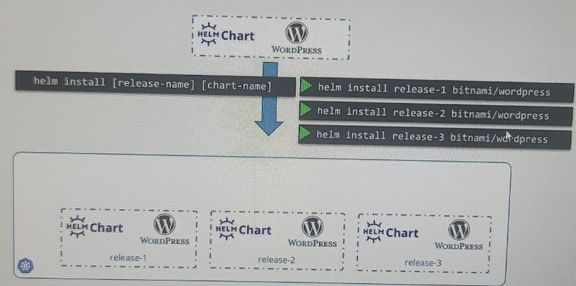

# HELM
- k8s - 04 helm: https://chatgpt.com/c/be9c3fd6-6caf-40c0-82c6-a7c28814284c
- install : https://helm.sh/docs/intro/quickstart/
- repo for helm charts: https://artifacthub.io/ --> search from web ui
  - or by command: `helm search hub aabbcc-chart`
  - can add  more repo/hub
- **helm repo add bitnami https://charts.bitnami.com/bitnami**
  - `helm search repo aabbcc-chart` # replace hub with repo.
  - helm repo list

---
## Intro
- definition:
  - `template engine` for K8s manifest yml files.
  - `package manager` for Kubernetes.
- benefit/s:
  - simplifies the process of defining, installing, and managing Kubernetes applications.
  - reuse across env and clusters.
- chart : collections of files that describe a `related set of Kubernetes resources`.
  - `Chart.yaml`: metadata - name, version, and description.
  - `Values.yaml`: 
    - default configuration values.
    - Users can override these values based on env while installing chart.
    - values-dev,prod,etc.
  - `Templates`: 
    - A directory that contains the Kubernetes resource definitions. 
    - yml : deployment/service/configmap/PersistentVolume 
  - `Charts`: dependencies
    - directory that can contain dependent charts.
---
## commands:
- create or pull
  - helm `create` spring-helm. 
  - helm pull --untar bitnami/wordpress
- helm list  
- helm `install` release-v2 spring-helm  # `uninstall`
  - -f custom-values.yaml
  - --set key1=value1,key2=value2
  - each release has name. here `release-v2`
- helm `upgrade` release-v2 spring-helm
- helm `delete` release-v2
- helm `history` release-v2
- helm `rollback` release-v2 revision-n

---
### Scenario / JT
1. deploy in order :  pod-2(kafka) >  then, pod-3(Database) > then, pod-1(SB)
2. `issues` without helm:
- so many deployment/service manifest yml : single chart with nested child chart
- deploy them in order : chart with dependent chart.
- rollout/rollback/version them all together : rollback, history, etc
- run deployment with env specific values :

