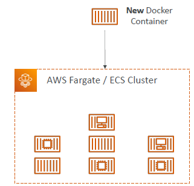
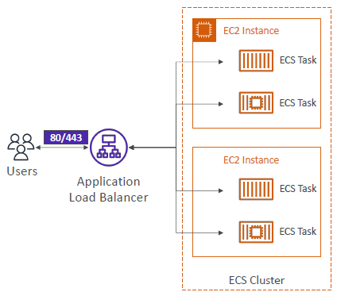
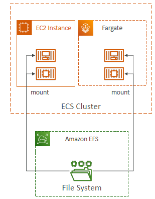
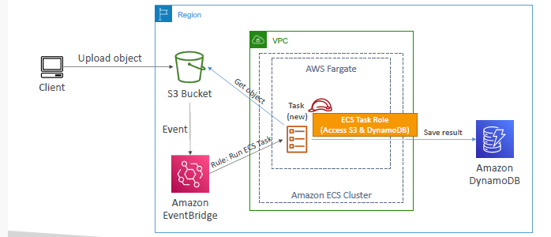
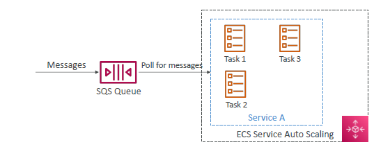
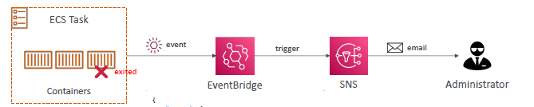

# Container in AWS
## A. key term
- `M` vs `VM` (virtualization) vs `Docker` (partial virtualization : share OS, n/w)
- store image : `ECR` , dockerHub
- image --> run --> `Container` (docker-demon / ecs-agent on ec2-i)
- docker container mgt:
  - `ECS - lauch: ec2` : amazon own container orch plateform
  - `ECS - lauch: fargate / fargate_spot` : serverless ECS
  - `EKS - lauch: ec2` : K8s is 3rd party container orch platform, EKS is amazon managed K8s, eks is `openSource`
  - `EKS - lauch: fargate / fargate_spot` : serverless EKS
- 
--- 
- Analogy with `k8s`
  - `pod` (c1,c2) - task(c1)
  - `node` (pod1,pod2) - service (t1,t2)
  - `service` - alb
  - `eks cluster` - ces cluster
  
---

## B. ECS 
- ECS-cluster --> provision (`container-instance` === ec2-i) --> provision `task`
  - `EC2-i1` (`ecs agent` === doker-deamon ) : `task-1 (running a single-container)`, task-2, ...
  - EC2-i2 : task-11, task-22, ...
  - EC2-i3 : task-111, task-222, ...
  - ...
  - ...
  - Notice: task are placed in specific Ec2-i
    - eg: task22 placed in Ec2-i2
- For fargate launch, don't think underlying ec2-i/s
---
### ECS Demo:
  - Step-1 : create `cluster-1` (choose one or more `infra`/launchType : ec2-i ** , fargate)
  - Step-2 :create `task definition`
    - `definition-1` :
      - choose launchType : ec2-i , also configure - os, cpu, ram, class
      - `task-role` : attach to ecs-agent `ec2-i-role` (must - ecr, cw, ecs)
      - `task-exec-role` : attach to task.
      - `container` : imageURI-1, port mapping,  env var , `storage` : EFS or default(21GB EBS)
    - `definition-2` : 
      - choose launchType : fargate
      - ...
      
  - Step-3 : provision and launch : `task` (for job) directly,  or wrap task with `service` (for long-running web-app) : srv1:[t1,t2,t3]
    - service name - `service-1`
    - choose :  task-definition :` definition-1` **
    - Desire capacity : 3 tasks (3 container - C1,C2,C3)
    - Define `networking`:
      - choose `subnet/VPC`
      - create `sg` : allow traffic http,etc --> this will attach to ec2-i or `hidden-ec2-i/in-fargate`
    - `expose` task/service : choose or create `ALB-1`
      - health check 
      - single-listener(http:80)  --> tg-1 ( C1,C2,C3 )
    - optional/more
      - `task placement`
      - `service Auto Scaling` : scale up/down task 
        - For ec2 launch
          - option-1 (`ASG`) : CW --> metric(CPU,etc) --> `ASG`(up/down Ec2-i and cantainer inside)
          - option-2 (`ECS-Cluster capcity provider`): preferred to use, smart, better.
        - For fargate: easy
          - ASG (scale up/down containers only)
          - `ECS-Cluster capcity provider` : intelligent to do everything.
      
  - READY
    - check cluster > task > container, logs/event,
    - update service - `manually` update Desire capacity : 5
    - in prod, service Auto Scaling (ASG, ECS-Cluster capcity provider) will do same.

---      
## C. screenshot
### 1. launch type:
 

### 2. iam roles/policies:

### 3. alb

### 4. Storage:

### 5 scale : ASG + Ecs-cluster capcity provider

 
## D. Use case / arch :
### D.1 with eventBridge ( trigger )

### D.2 with eventBridge ( scheduled )

### D.3 with SQS + autoScale

### D.3 with SNS

