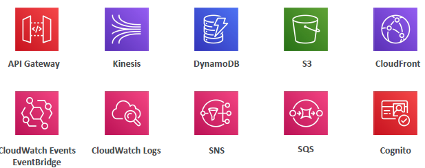

# Intro Serverless in AWS
- there is underlying server/ec2-i, but don't need to provision/manage it
  - AWS Lambda
  - DynamoDB
  - AWS Cognito
  - AWS API Gateway
  - Amazon S3
  - AWS SNS & SQS
  - AWS Kinesis Data Firehose
  - Aurora Serverless
  - Step Functions
  - Fargate
- 
--- 
# AWS : lambda 
## Function
- lambda initially was `FaaS`. Now serverless : `provision code/function` 
- deploy code without underlying infra
- `auto-scale with load` (parallel Lambdas, `max- 1000`)

- `network`:  
  - default : run in` aws owned VPC`, launch outside out VPC-1
  - can attach ENI with our VPC-1
  
- `cost` : per request +  compute-time(0-15 min) : `very Cheap`/`cost-efficeint`
  - First 1M free, then `20cent/million req`
  - First 400K GB-second free, then `$1/600K GB-second`
- `security`: Attach IAM role.

- `Configuration`:
  - RAM : `RAM 128 MB -10 GB`
  - timeout 0-15 min `15 min` / `900 Sec`
  - trigger:
  - handler : file.method (eg: l_function.l_handler)
  - runtime : java 11, java21, etc
  - permission : attach one or more role/s (already allow CW)
  - env var : 4 KB
  - disk : `/tmp` , `512 MD to 10GB`

- deployment pkg size :
  - `50 MB`  compressed
  - `250 MB` code+dependency
  
-  logs : CW : log group
-  lang : node,py,java,Golang, `C#/Ruby`, `Custom Runtime`
  - java 11 or above : performance is 10x (free) - `SnapStart` feature
- `Lambda Container Image` --> run --> lambda Function
  - `base image` : lambda runtime API
  
---
## integrated with services / triggers
- API-gateway/`REST` --> lambda
- S3, CW, DynamoDB, eventBridge(trigger/schedule) > `event` > Lambda
- SQS/SNS > lambda as Consumer/Subscriber
- Kinesis DataStream > `consumer` > Lambda
- lambda with CloudWatch `lambda@Edge`
- IAM:`cognito` > Lambda
- 

---
## Use case
- 
- 
- > connect lambda (launch in vpc-1) --> RDS-proxy : good practice  

- 
---
## Screeshot:

