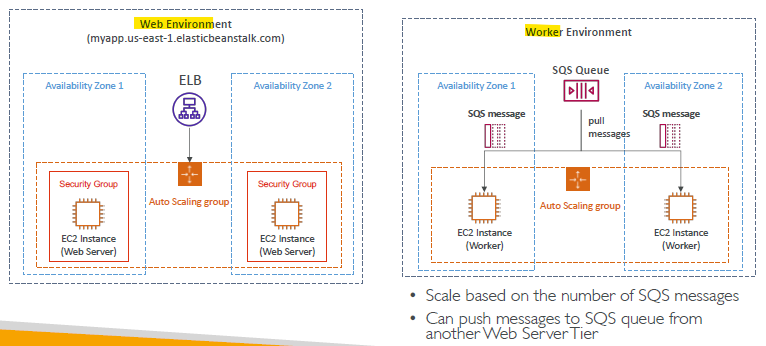

# Elastic Beanstalk 
- Most web apps have the same architecture (ALB + ASG), etc
- All the developers want is for their code to run, across different applications and environments.
- and, don't want to deal with :
  - Managing infrastructure
  - Deploying Code
  - Configuring all the databases, load balancers, etc
  - Scaling concerns.
- Managed services, uses all the components - EC2, ASG, ELB, RDS, etc
- free, but pay for underlying infra.

## Components:
- `Application` : appl version + env + configuration
- `configuration`
- `Application version` : code/s
- `Environment`/s :  dev, prod, qa
  - AWS resource running application.
  - `Tier`
    - `web server env`
    - `worker env`
    -   
- Notice : same AWS acct, all env.

---    
## Deployment Modes

---
## demo
- Create Application
  - create environmnet
    - choose tier : web* or worker
  - choose platform : language,runtime,etc - java,etc
  - code : upload
  - Configuration preset
    - deployment mode - single, high ava
    - custom
      - ...
      - ...
      - ...
  - role
    - add pre created policies : 
      - `AWSElasticBeanStalkWebTier`,
      - `AWSElasticBeanStalkWorkerTier`, 
      - `AWSElasticBeanStalkMultiContainerDocker`
      - ...
      - ...
      
- it creates `cloudFormation template`
  - view the template in appl-composer.

- get domain url and use it.
- upload new code, seamlessly.
- check other tab : CW, monitor, mmanged updates, alarms, health, etc
- Check `configuration` link on left
  - show all the configs for env
  - edit them