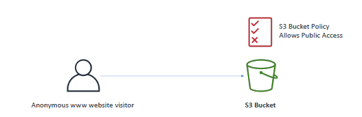

# S3 : Security
- At account level can enable/disable `public` flag.

## think scenarios
- let's have aws1:s3-bucket1/obj-1 (publicly exposed)
- aws1:`iam-user` --> saws1:s3
  - `iam-policies` attached on `iam-user`
  - 
- `aws2`:`iam-principle` | www-user --> aws1:s3-bucket1/obj-1
  - make Non-public + `Bucket-policies`  - for cross account access, etc
  - `Object ACL`, `bucket ACL`
  - 
  - 
  - 
---

## Advance
