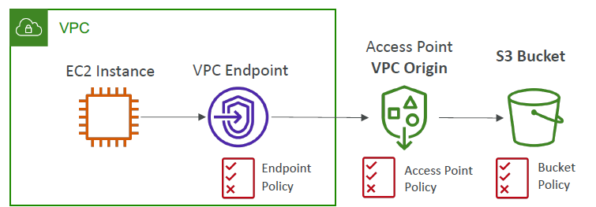
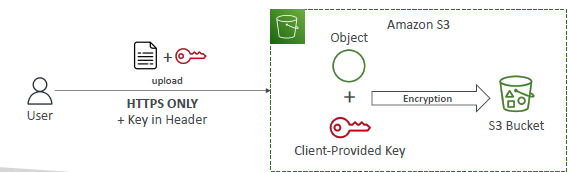

# S3 : Security
- At account level can enable/disable `public` flag
- Make Non-public + set `Bucket-policies` (json)
  - json-1: enforces encryption ate rest
    - allow/deny : putObject on bucket-1, if condition : sse-kms=true
  - json-2 : enforce SSL or encryption at fly
    - allow/deny : putObject on bucket-1, if condition: secureTransport=true
    
- Enable `server-access-log` :
  - s3-bucket-1 > properties > access log  --> choose `another bucket-2` and log-format(default)
  - Also, this will auto-update `bucket-policies`
    - allow logging : bucket-1
    - allow putObject/logfile : bucket-2
    
- `temp access` on object : 
  - generated from UI/cli a `Pre-signed URL` and share. set `expiry`
  
- `s3:access point` simplifies security mgt

- `VPC-endpoint/interface(to access s3)` --> `s3:access-point` --> `bucket:selected-object` 
  - notice `policy` attached to all.
  - 

## A.Scenarios
- aws1:`iam-principle` --> `aws2`:s3-bucket1/obj-1 : `cross acct access`
- principle: IAM-user  + federated use, aws-service, role
- 
- 
- 
- 

---
## B. ACL
- `Object ACL`
- `bucket ACL`

---
## C. CORS
- web browser security.
```
// SPA
- server-1(ng:SPA) + server-2(api)
- browser --> server-1
- browser(ng)--> server-2(api) --> response:header:access-control-allow-Origin=server-1

// S3 static website
- bucket-1(index.html) + bucket-2(images, other resource, page-1.html)
   - update bucket policies:  getObject for all * prinicple.
- browser --> bucket-1
- browser(index.html) --> ajax::fetch(bucket-2/page-1.html) --> bucket-2 --> will work, only CORS is enabled to bucket-1 as origin 
- bucket-2 > permission tab > edit CORS > add json:origin-bucket-1
```


---
## D. Encryption (v:149,s:309)
- At REST
  - server side encryption, `sse` :
    - `sse-s3` (default) : encryption-key provided/owner by `aws:s3` , http header : "x-amz-server-side-encryption": `AES256`
    - `sse-kms` : encryption-key comes from `kms` ,  http header : "x-amz-server-side-encryption": `aws:kms`
      - client create kms-key before.
      - s3 --> api-call --> KMS (slow)
      - `dsse-kms` came 2023
    - `sse-c` : customer provide key (outside aws)
  client side encryption `cse` : client upload encrypted object
- At transit (TLC/SSL)
  - `http` endpoint
  - `https` endpoint -> update bucket policy : deny http
  - 

---
## E. MFA delete
- root account  : setupMFA
- setup aws-cli with root AccessKey  + secretAccessKey
```
aws s3api put-bucket-versioning 
    --bucket <bucket-name> 
    --versioning-configuration Status=Enabled,MFADelete=Enabled 
    --mfa "arn:aws:iam::<account-id>:mfa/<mfa-device> <mfa-code>"
    
next, attempt to delete object version

MFADelete=disabled 
```
---
# More
## ScreenShot
- 
- 
- 
- 
- CORS:
- 