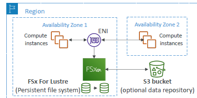
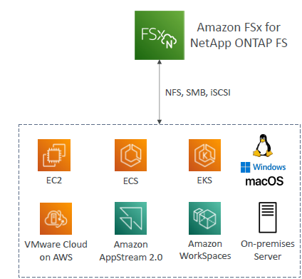
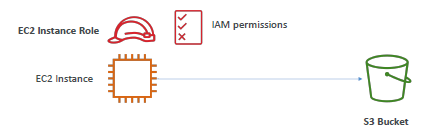
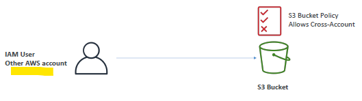
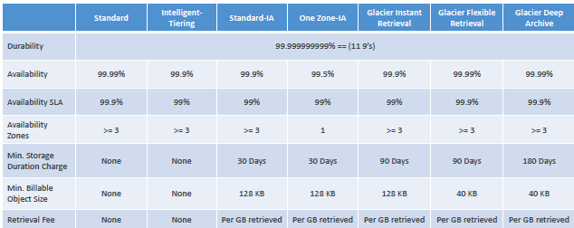

# s3
- `infinitely scaling` storage,  highly `durable`, highly `available`
- other services use S3 as an `integration` + main `building blocks` of AWS
- `regional` service. (bucket-name: globally unique, 3-63)

---
## A. S3: Use case
- `storage` + Hybrid-Cloud-storage , `Archive` ,  `Backup` (eg: snapshot : ebs,efs,db )
- `hosting`: Media, Static website, Application | Software delivery
- `DR` 
  - `cross-region-replication`, move data from region to another then restore.
- on s3 --> run Data lakes & big data `analytics`.

---
## C. bucket
- > s3://my-bucket/my_folder1/another_folder/my_file.txt
  - `bucket` : my-bucket
    - general-purpose + Directory(New)
  - `object`: my_file.txt.
    - max:`5TB`
    - metadata : info about object in k-v form
    - tags
    - versionID
  - `key`: my_folder1/another_folder/my_file.txt.
    - key contain "/", looks like directory but `no-concept-of-directory`
    
### C.1. bucket: security
- At account level can enable/disable public flag.
- let's have aws1:s3-bucket1/obj-1 (publicly exposed)
- scenarios:
  - aws1:`iam-user` --> saws1:s3
    - `iam-policies` attached on `iam-user`
    - 
  - `aws2`:`iam-principle` | www-user --> aws1:s3-bucket1/obj-1
    - make Non-public + `Bucket-policies`  - for cross account access, etc
    - `Object ACL` 
    - `bucket ACL`
    - 
    - 
    - 

---
### C.2. bucket: versioning
- enable for each bucket + UI:showVersion.
- can roll back to previous version/s
- protect again un-intended delete.
- delete:
  - `delete` : adds delete marker.
  - `delete marker` : undo delete.
  - UI: show-version > select version > `delete the version` : permanent deletes.

---
### C.3. bucket: Replication (async)
- `enable version` is must on src and dest buckets + `attach IAM`
- replicate : [ object + delete marker(y/n) ]
- `No chaining`:
  - having b1 --> b2 | b2 --> b3
  - if obj-1 added in b1, it will be replicated to b2 only.
- only `new` object will be replicated.
- for `old` objects : use `S3 Batch replication`  separately.
- Type:
  - SRR (same region)
  - CRR (Cross region)
  
---
## D. S3:bucket:object - storage Classes
- Amazon S3 `Standard`
  - General Purpose : highly durable/available.
  - Infrequent Access (IA) : low cost, `usecase`:DR-backup/recovery
  - One Zone-Infrequent Access : single-AZ, `usecase`:data which can recreate.

- Amazon S3 `Glacier` : low cost + but retrieval free, `usecase`:archive,
  - Instant Retrieval : retrieval (ms), `min:90 days`
  - Flexible Retrieval : retrieval (1-5 min, 3-5 hr, 5-12 hr:free)  `min:90 days`
  - Deep Archive :   retrieval (12 hr, 48 hr)`min:180 days`

- Amazon S3 `Intelligent Tiering`
  - move object b/w tier based on (usage + config)
  - mix of above classes into single
  - `tiers`:
    - `Frequent Access` tier (automatic): default tier
    - `Infrequent Access` tier (automatic): objects not accessed for 30 days
    - `Archive Instant Access` tier (automatic): objects not accessed for 90 days
    - `Archive Access tier` (optional): configurable from 90 days to 700+ days
    - `Deep-Archive Access` tier (optional): config. from 180 days to 700+ days
- comparison:
  

---
## E. Demo
```  
  - create bucket - bucket-1-us-west-2, will be created in all AZ.
  - disable : ACL, , versioning
  - enable : public access + attach BUCKET POLICIES (read from any principle, resource:*)
  - encryption: SSE-S3 *, SSE-KMS, DSSE-KMS
  - upload png file
  - https://bucket-1-us-west-2.s3.us-west-2.amazonaws.com/Screenshot+2024-07-16+002401.png
  - inspect : 
      - Open link --> `s3 pre-signed url`, credential-info are encode in url.
      - access with public-url :  failed | ok after making public.
  - static website hoisting : enable on bucket + index.html
    - endpoints: https://bucket-1.s3-website.region.amazon.com
    
  // Replication
  - create another  buvket-2-us-west-1
  - create replication rule:
    - add target bucket : bucket-1-us-west-2
    - enable versionsing
    - craete new IAM
    
  // storage classes:
  - bucket-1 > mgt > creat Life Cycle rule
    - select object: all or by-prefix/suffix
    - rule-1 : move from class1 to clas2 after xxdays
    - ...
    - ... 
```


  


