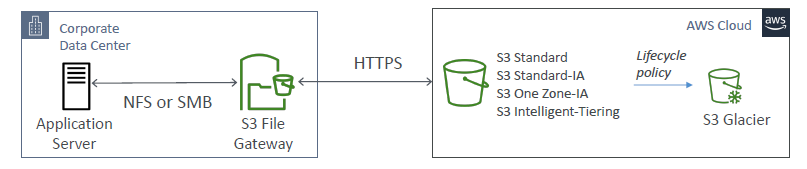
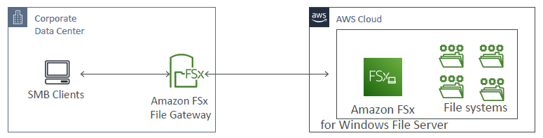
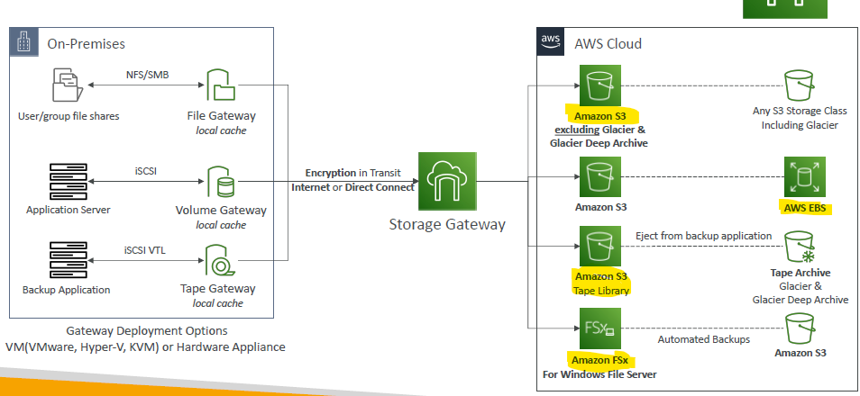

# Storage Gateway 
- `on-prem`  <--> gateway <--> `aws`(data: Object-storage/S3, File-storage/FS+EFS, Block storage/EBS)
- purpose : hybrid storage, migration, DR and backup
- gateway is supposed install on on-prem datacenter. <<<
  - order `gateway Hardware appliance`
  - it has required CPU, memory, n/w, etc

## Type
  - s3 gateway
    - `on-prem`  <-- NFS, SMB--> **s3-gateway** <--> `aws`(Object-storage/S3)
    - 
    
  - FXs/file gateway
    - `on-prem`  <-- SMB, NTFS, etc --> **file-gateway** <--> `aws`(File-storage/FS+EFS)
    - `on-prem`  <--> `aws`(File-storage/FS+EFS) : could directly access as well.
    - `Local cache` : gateway help to cache frequent access file/data.
    - 
    
  - Volume gateway
    - `on-prem`  <-- iSCSI --> **Volume-gateway** <--> `aws`(EBS volume backup on S3)
    - 
    
  - Tap gateway 
    - tap : physical tapes, drive.
    - `on-prem`  <-- iSCSI VTL --> **tap-gateway** <--> `aws`(S3 has `VTL` running --> glacier)
    - VTL : virtual tap library
    - 

---
## Summary

