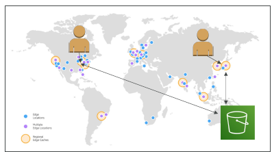
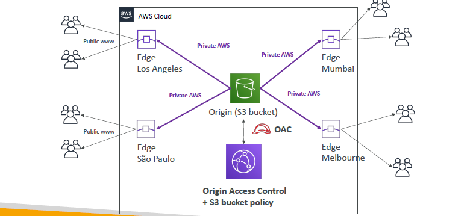

# AWS cloudFront / CDN (s:332)
- `global `service.
- content delivery network, cache data all around the world.
- `static`-content cached for TTL (eg : a day)
- benefit: - protect from `DDoS`, cached >low latency,

## Key term
- > `edgeLoc` has cloudFront distributions running >  has Local-cache ( for static Content)
- `origin` of CF : `s3 bucket` or  `s3(static Web), Any http backend, ALB`
  - CF connected to origin with `privatelink`
- `distribution` : cache created across the globe.
- `origin access` :
  - `public` 
  - `OAC` : `Origin access control` : this allow CF to connect/access origin. 
    - so we don't need to make bucket public
  
- demo (s3 as origin) :
```
  - create CF > distribution-1
    - choose default object (optional) : index.html
    - choose `origin` : add s3-bucket-1 + upload index.html
        - choose `origin-access` (s3 access ways) :
            - public, or
            - OAC (only CF access) **
                - create OAC-1 and attach to deistribution-1
                - Copy OAC-1:policy
  
  - update s3-bucket-1 policy with OAC-1:policy.
    - this will allow distribution-1 to access s3.
   
  - Copy public-url and hit
    - open index.html.
    
  - Now upload abc.png in bucket
  - hit public-url/abc.hit
  - this comes from distributio, not directly from s3.
  
   - Now upload sub-folder/abc.png in bucket
  - hit public-url/sub-folder/abc.hit
  - ...
  - ...
```

---
## ScreenShot
- 
- 
- 
- OAC-policy:
  - 
---  


