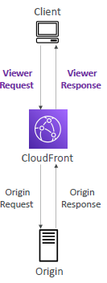

# AWS cloudFront / CDN (s:332)
- `global `service.
- content delivery network, cache data all around the world/`countries`
  - can create `allow-list`
  - `black-list` of countries.
- `static`-content cached for TTL (eg : a day)
- also can `invalidate` cache at any time
- benefit: - protect from `DDoS`, cached >low `latency`,

## Key term
- > `edgeLoc` has cloudFront distributions running >  has Local-cache ( for static Content)
- `distribution` : cache created across the globe.
- `origin` of CF : `s3 bucket` or  `s3(static Web), Any http backend, ALB`
  - physically CF connected to origin with `privatelink`
  - cf also needs access-policy to access origin
- `origin access` :
  - make origin `publicly` accessible.
    - get list of Public IPs of all 400+ edge location
    - add app level security to allow access only to above IPs.
  - `OAC` : `Origin access control` : this allow CF to connect/access origin. 

---
## CloudWatch Function
- Run some code at CloudFrount distributon type : 
  - `lambda@Edge` : 
    - `nodeJs or Py`
    - Note: regional, written in region-1, CF replicate to all edge loc.
    - thousand/s, since lambda is heavy. 
    - set `exec time : 5-10 sec`. forget about 900 sec.
  - `CloudFront-Function` : 
    - `very light weight` fun written in` js.`
    - 10 KB pkg
    - millionReq/Sec
    - Max 2Mb ram
    - 1/6 time cheap than lambda.
  
- `purpose`: Customise CDN content :
  - Website Security and Privacy
  - Dynamic Web Application at the Edge
  - Search Engine Optimization (SEO)
  - Intelligently Route Across Origins and Data Centers
  - Bot Mitigation at the Edge
  - Real-time Image Transformation
  - A/B Testing
  - User Authentication and Authorization
  - User Prioritization
  - User Tracking and Analytics
- 
- 
---
## Demo  
### Demo-1 (s3 as origin) :
```
  - create CF > distribution-1
    - choose default object (optional) : index.html
    - choose `origin` : add s3-bucket-1 + upload index.html
        - choose `origin-access` (s3 access ways) :
            - public, or
            - OAC **
                - create OAC-1 and attach to distribution-1
                - Copy OAC-1:policy
                - so we don't need to make s3-bucket-1 public
  
  - update s3-bucket-1 policy with `OAC-1:policy`.
    - this will allow distribution-1 to access s3.
   
  - Copy public-url and hit it
    - public-url --> redirect to --> public-url/index.html.
    
  - Now upload abc.png in bucket
  - hit - blic-url/abc.hit
  - this comes from distributio, not directly from s3.
  
   - Now upload sub-folder/abc.png in bucket
  - hit - public-url/sub-folder/abc.hit
  - ...
  - so on
```
---
### Demo-1 (ALB as origin) :
``` pending...```


## Pricing

- price class
  - `100`
  - `200`
  - `ALL`
- 

---
## ScreenShot
- 
- 
- 
- OAC-policy: add/merge to/with the bucket policy
  - 
- 
- more : 
---  


