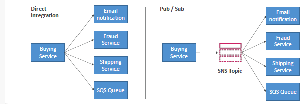
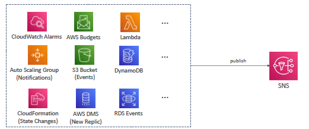
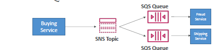
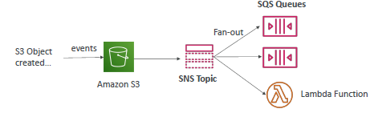

## SNS - PUB/SUB decouple Model
- 
- 100k topic per account, can be extended.
- Like SQS, Standard + FIFO
- event producer --> topic(message +`attributes`) --> subscriber-1,2,3... `12 million`
  - all message will go to all subscribers
  - subscription- filter policy 
    - filter message by `message attribute`
    - 

---
## List : Subscriber and publisher 
- 
- 

---
## SNS : Security
- Encryption
    - In-flight encryption using `HTTPS` API (SSL/TLS)
    - At-rest encryption using KMS keys (`sse-sqs`, `sse-kms`, `sse-c`)
    - `Client-side encryption` if the client wants to perform encryption/decryption itself
- `SNS bucket policy` : eg: cross queue access, allow other service, etc
- principle (attach `IAM policy`) --> access queue

---
## use case
- SQS + SNS fan out pattern
  - 
  - 
  - 
