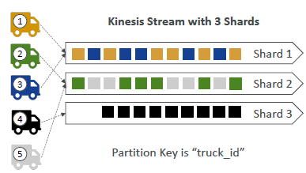
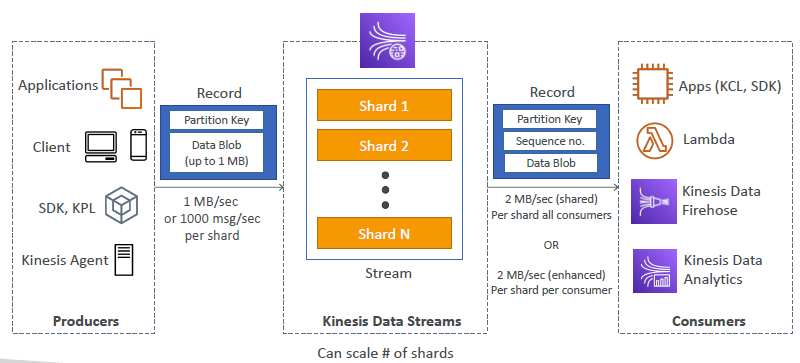
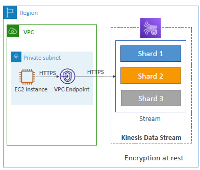
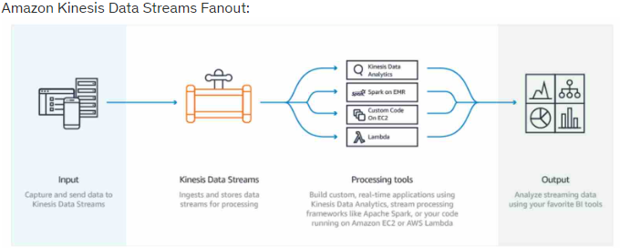

# Kinesis
- `real-time data` (app log,CW metric ) --> collect > analyze/process
- services (4) :
  - Data `Stream`
  - Data `Firehose`
  - Data `Analytic`
  - `Video Streams`
---

## A. Kinesis : Data Stream 
- `ingest data at scale` + `real-time processing`
- `stream` : `shard/s` --> shard-1, shard-2, ... 
  - record count :` 1000 record/sec/shard` : if 6 shards => 6000 message/sec
  - produce speed : `1 MB/sec/shard ` : if 6 shards => 6MB/s
  - consume speed : `2 MB/sec/shard` : if 6 shards => 12MB/s
  - So,` shard count driven`
  - more like kafka
    - 
  - order : data in each shared is ordered.
  - one consumer per shard
  
- record == [ shard#,Blob(data) 1MB-max ]
- `producer` : app(`SDK/KPL`),  `kineses-Agent`
- `consumer` : app(`SDK/KCL`), lambda, k firehose, K analytic
- 

- retention : 1 - 365 days

- `capacity`:
  - `provisioned`:
    - choose shard count needed.
    - cost - hourly `per shard`
  - `on-demand`
    - scale automatically based on last 30 throughput peek history
    - cost - hourly `per stream`, data in/out GB
    - Also, `4000 record/sec/shard + 4 MB/sec/shard`  :)
    
- summary:
  - 
  
- `VPC endpoint` available for Kinesis Data Stream
  - 
- demo : aws cli > produce cmd + consume cmd. (v:193)
- Security: IAM policy, Encryption (rest-kms, fly-tLS/ssl)

- QnA:
  - use the `Enhanced Fanout feature`
    - provides each consumer application with its own dedicated throughput, up to 2 MB/second.
    - Multiple consumers can simultaneously process the same data stream without affecting each other's performance.
    - 
  - S3 --> `DMS` --> kinesis
  - 
---

## B. Kinesis : Data Firehose 
- `Near Real-time Delivery`
- fully managed, no administration, auto scale, serverless
- for `delivering` real-time streaming data to `destinations` :
  - Amazon - `S3`, `Redshift`, `Elasticsearch`  
  - 3rd party - Splunk, datadog
  - custom - Https-endpoint
- Supports ETL : can transform record with lambda, support compression
- can set buffer `size 0-900Sec`
- if delivery failed, store failed record in s3 bucket.
- fact : `Kinesis Agent` cannot write to KDF, for which source is already set as KDS
  - source-1: KDS --> KDF
  - source-2: kinesis-agent --> **NOT** --> KDF
- 
