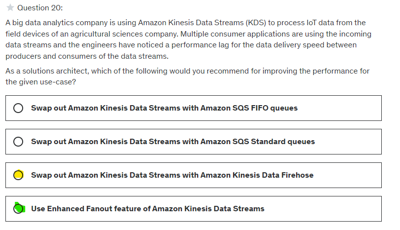

# Kinesis
- `real-time data` (app log,CW metric ) --> collect > analyze/process
- services (4) :
  - Data `Stream`
  - Data `Firehose`
  - Data `Analytic`
  - `Video Streams`
---

## A. Kinesis : Data Stream
- `stream` : `shard/s` --> shard-1, shard-2, ... 
  - record count :` 1000 record/sec/shard` : if 6 shards => 6000 message/sec
  - produce speed : `1 MB/sec/shard `
  - consume speed : `2 MB/sec/shard`
  - So,` shard count driven`
- record == [ shard#,Blob(data) 1MB-max ]
- `producer` : app(`SDK/KPL` - K producer lib),  `kineses-Agent`
- `consumer` : app(`SDK/KCL` - K client lib), lambda, k firehose, K analytic
- 

- retention : 1 - 365 days
- Security: IAM policy, Encryption (rest-kms, fly-tLS/ssl)
- `capacity`:
  - `provisioned`:
    - choose shard count needed.
    - cost - hourly `per shard`
  - `on-demand`
    - scale automatically based on last 30 throughput peek history
    - cost - hourly `per stream`, data in/out GB
    - Also, `4000 record/shard + 4 MB/s`  :)
- summary:
  - 
  
- `VPC endpoint` available for K Data Stream
  - 
- demo : aws cli > produce cmd + consume cmd. (v:193)
---

## B. Kinesis : Data Firehose 
