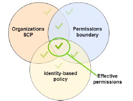
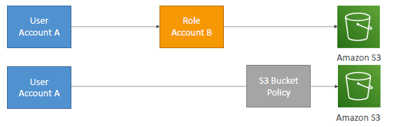
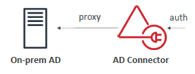
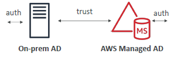
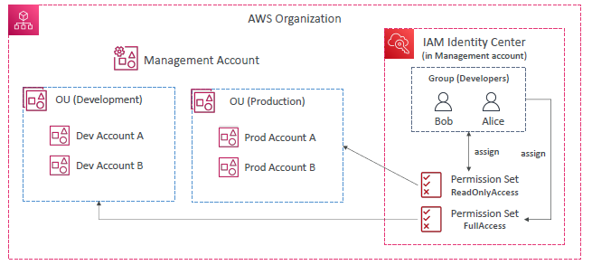
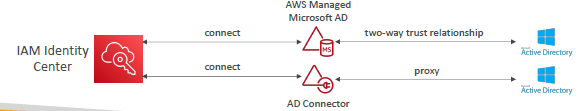
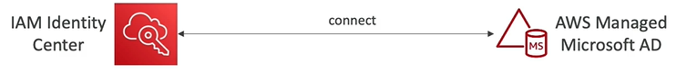

# IAM
- IAM_01 https://chatgpt.com/c/3bfd592e-3ccc-403f-a61c-8e6ab72eacf5

## A. key items
- root `user` + MFA + use strong password policy
- IAM user, `Group` (attach permission)
- permission : JSON doc / `policies`
- prebuilt policies - eg: fullSQSaccess, fulls3access, etc
- AWS CLI / prog - `Access keys ID + secret Access key`
---
- IAM `roles`
  - Designed to provide `temporary security credentials` by `trusted entities/principle`: 
    - other aws-service - ec2, s3,etc
    - cross account service/user, 
    - `federated` : `outside AWS user`, authentcated by an external identity provider (okta,google,fb) using SAML,OIDC,OAUTH2.0
  
  - has `policy` >  json : [ effect, action, resource, condition ]
  
  - `STS` : secure token service
    - provides `temporary` security credentials(Access key + secret) + token(permission)
    - short-lived, few mins.
    - actions : `assumeRole`, `assumeRoleWithSAML`, etc

- `Resource Policy` 
- `Permission Boundary`
  - json looks similar to policy.
  - attach to Prinicple
  - eg: boundary-1 : allow  `ecs,lambda,s3` only
    - attach to iam-user-1
    - iam-user-1 --> attach iam-policy(`sqs` access) 
    - iam-user-1 cannot access sqs, since its outside boundary. 
  - used in AWS org.
  - 

---
## B. cross account access
- `AWS-1(user-11)` --> has to access -->  `AWS-2(resource : R1)`
  - option-1 (ResourcePolicy) : R1 - `resource-based-Policy `(update/add - allow AWS-1(user-11) )
  - option-2 (IAM policy > assume):
    - AWS-2 > create `role-1` > policy-1 : allow AWS-1(user-11) to R1.
      - principle,user-11 does not give up orginal permission
    - AWS-2 > create policy : allow user-11 to assume `role-1`
    - user-11 `assume role-1` and access it.
      - principle,user-11 will first give up all the original permission, first.
      - then assume/get role-1
- 
- For S3, SQS,SNS,Lambda - use resource-based-Policy
- for Kinesis Db- use iam role
- gimme-aws-cred : can assume certain role, not all. think.

---
## C. IAM Audit 
- check below `Reports`:
  - `user level` : access advisor, etc
  - `account level` : credential report, etc

---
## D. Evaluation logic
- explicit deny + then allow : both present === deny

---
## E. AWS : AD active directory
### Simple AD

- aws managed AD, users present only in this AD

### AD Connector

- users present in on-prem AD
- `proxy` help to connect it.

### AWS managed AD

- hybrid : user present in AWS AD + on-prem AD
- AWS AD create trust with on-prem AD

---
## F. AWS SSO / Identity provider
- use case:
  - sso for all account in [aws org](./03_AWS_org.md)
  - sso for all ec2 instance in an aws account
- has/Container : 
  - `AD : Active directory` : aws provided + integrate to 3rd party IP (LDAP, OKta, etc)
    - [check here](#f-aws--ad-active-directory)
  - `permission set` : which user has access to what: `fine grained permission and assginmnet`
    - lek role-1(full-access) on  member-account-1
    - lek role-2(read-access) on  member-account-1
    - lek role-3(write-access) on  member-account-1
    - lek role-1(write-access) on  member-account-2
    
- lek -> okta home > --> aws-mgt:`AWS IP/SSO with permission-Set` --> `Okta SSO` 
  - member-account-1 > assume role-1, role-2, role-3
  - member-account-2 > assume role-1
  - how and where SAML fits ?

- 
- 
- 
--- 
- 

