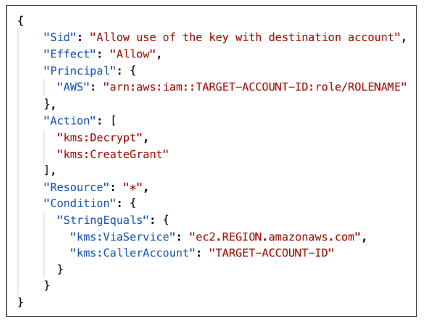
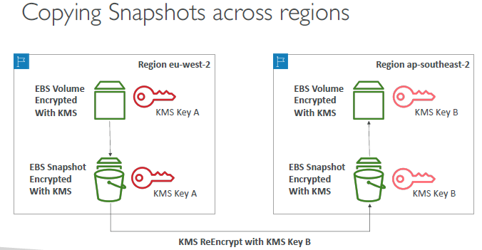
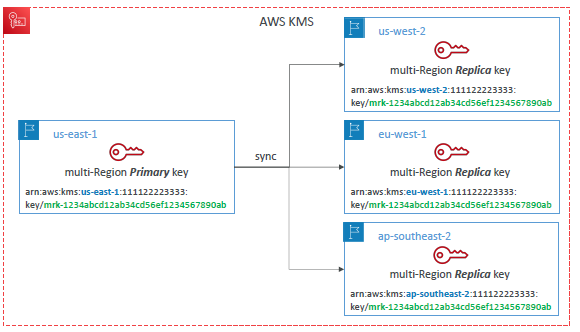

# KMS
## A. Encryption flow
- `server side`
  - encryption at `fly` (TLS / SSL certificate)
  - encryption at `rest` (at server side)
  - eg:  
    - file --> upload -->public internet --> 
    - https(encryption) --> AWS-acct --> decrypted/TLS --> s3(file uploaded) --> 
    - S3 make KMS-api --> KMS:kms-key --> stored encrypted
- `encryption outside AWS` : `client side encryption`, if:
  - Don't trust server
  - cant make KMS api call
  
---
## B. Key points
- integrated with `IAM`. check more.
- Audit `AWS-key-usage`,  using `CloudTrail`
- encrypt password with kms --> then store to secret manager

### regionality:
- `single regional` : same key cannot be present in 2 diff regions. 
  - Scenario: cross region snapshot copy
    - ebs-volume in region-1-`az1` --> region-1-key --> backup/encrypt --> restored to region-1-`az2/3` : VALID
    - ebs-volume in region-1-`az1` --> region-1-key --> backup/encrypt --> restored to `region-2`-az1  : INVALID
      - ebs-volume in region-1-`az1` --> region-1-key --> backup/encrypt --> `re-encrpted with region-2-key` --> restored to region-2-az1
        
- `multi regional` : same key is replicated over regions.
  - `primary` (policy-1) + `replicatedd key` (policy-2)
  - policy can not be modified for each region separately.
  - purspose : 
    - encrypt in one region and use/decript in another region.
    - dont need to re-encrypt again with another region key
  - `Not recommended to use`. use exceptionally
  - use-case : 
    - global Aurora DB, 
    - global Dynamo DB
    - having client side encryption

- eg: S3 CRR replication with KMS : [here](./../02_storage/03_S3-1.md#security-while-crr-replication)
  
---
### kms-keys : symmetric
-  single-key (private), user cant-see, aws use to encrypt/decrypt 
- Types:
  - `AWS owned` : kms-s3. kms-sns, etc FREE
  - `AWS managed key` :  FREE. request another key from aws
  - `Customer manged key` : customer upload it s own key. 
    - price : 1$/month + calls : `3 cent / 10,000 call`
- rotation:  yearly

### kms-keys : A-symmetric 
- for: client side encryption
- customer download public-key, use it for encryption.
- Scenario : 
  - ( `public-key` + data) --> uploaded `encrypted` data to s3-bucket-1.
  - Another bucket, s3-bucket-`2` need data, will make `KMS api call` to get `decrypted` data
  - and decryption will be done by it `private key`.

## KMS Policy
- like s3 policy
- define who can access key.
- default policy : allows everyone in account
- create custom policy : for cross account access
- eg-1: 
  - lambda-1 copy ebs snapshot from one region to another region
  - lambda-1 must have access to 
    - region-1-EBS-volume + region-1-key (to decrypt)
    - region-2-key (to re-encrypt)
  - update custom policy accordingly
- eg-2: cross account kms access
  - 

---
## D.Demo
```
- crate key-1
- choose : regionality : single region
- choose access permision : 
    - check boxes - check who can access
    - cross account access (optinal) : add another aws acct
    - this will auto create access policy
- rotation yearly : y/n
- review and done

// READY
- actin:
    - disable
    - schedule for deletion 
   
- use aws-cli : encypti failtext with above key-1    
```

---
## Z. Screenshot
- 
- 
- 
- 
- 
---
regional key with global dynao and aurora
- 
- 