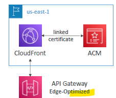

# ACM

- import: private/public (free)

- import internal cert (ACM generated cert)
  - Auto-renew in `60 days ` before.
  
- import External cert (`digicert`)
  - digi-cert: generate cert for FQDN or with wildcard
    - dev1.outbound.aws.org.com,  dev1.outbound.aws.org.com
    - *.outbound.aws.org.com
    - *..aws.org.com
    
  - Choose validation method
    - `email` : ?
    - `dns` : just, create `cname` entry in R53 with above dns
  - no auto re-new
    - but sends `eventBridge` event to expiration, before `45 days`
    - can catch event --> SNS alert, lambda, 
    - `AWS-Config > rule:acm-cert-expiracy-check` --> change days from 45 to something else.
    
- ACM has `integration` with
  - CloudFront `distribution`
  - R53
  - `LB` : ALB, NLB, ... 
    - 
  - `API gateway`
    - `edge-optimized` : keep ACM cert in `us-east-1`
    - 
    - `regional`, `private( withInvpc)` : keep ACM cert in same region
    - 

