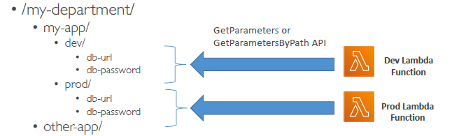

# WAF (webapp FireWall)
- `webApp --> ALB(layer:7) --> WAF(l7):ACL` ---> expose to web-client
- `webApp --> NLB(layer:4) --> WAF(l7)` : invalid, since nlb is layer4.
 
- deploy on top of :
  - `regionally` : ALB, API-gateway, AppSync(GrapgQL-API)
  - `globally`  : CloudFront distribution
 
---
## WAF : web ACL 
- reusable rules:
  - `HTTP headers, HTTP body, or URI strings` - `SQL injection` and `Cross-Site Scripting (XSS)`
  - Size constraints
  - geo-match  - block countries.
  - `Rate-based rules` eg: 10 req/per – `DDoS protection`
  
  - `IP Set`: 
    - allowed ips set, up to `10,000 IPs` max in a set.
    - use multiple Rules for more IPs.
    - keep IP `static/fixed`:
      - use fixed for API for ALB
      - use AWS global accelerator (has fixed any-cast IPs)
      - > `webApp --> ALB(layer:7) --> WAF(l7):ACL --> AWS global accelerator` --> expose to web-client.
      
      

