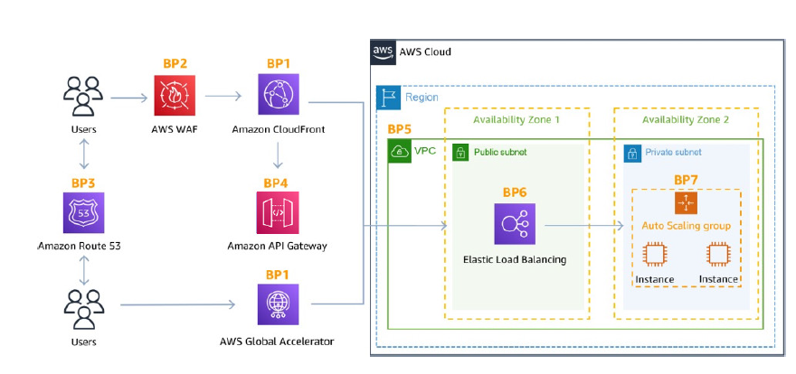

--> sample architecture : kind on combination can have

---
## Application front face and flow
- `step-1` : client -->

  - `step-2` : Route 53 `DDoS protected` -->
  
    - `step-3.1` : region/vpc
      - with/without WAF --> `API-gateway-regional` --> ...
      - with/without WAF --> alb --> ...
    
    - `step-3.2` : edge Location `DDoS protected` -->
    
      - `step-4.1` : with/without WAF --> `API-gateway-edge-optimized` (global) --> CF distribution (global) --> ...
      
      - `step-4.2` :with/without WAF --> `CF distribution`(global) --> ...
        - `step-4.2.1` :region/vpc
          - ec2
          - with/without WAF --> API-gateway-regional --> ...
          - with/without WAF --> alb --> ec2/container
          - with/without WAF --> alb --> ASG --> ec2/container
        
      - `step-4.3` : `Global Accelerator`(global) --> endpoint-group[ region1:az1:abl-1, region2:az1:alb-2,... ]
        - `step-4.3.1` :region/vpc
          - ec2
          - with/without WAF --> API-gateway-regional --> ...
          - with/without WAF --> alb --> ec2/container 
          - with/without WAF --> alb --> ASG --> ec2/container

---
## protection point
- shield advance
- shield standard
- WAF - web ACL
- network ACL ?
- subnet ACL
- ASG/EC2 -> SG

---
- edge location : CF, acc, API-gateway-edge-optimzied
