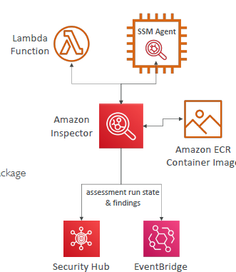

# A. GaurdDuty
- enable it , 30 days trail, fully managed by aws
- collect below data and perform `ML algo + AI`, to detect/discover any `security threat`.
  - `dns` logs
  - `vpc` logs
  - cloudTrail event : mgt, s3 ?
  - `optional` : enable these logs too... `EKS,RDS,Aurora,EBS,L,S3`
- Send `finding/discovery` data to --> `event-bridge`

- > good to find `CryptoCurrency` attack and protect.

---
# C. Macie
- fully managed by aws
- uses ML + pattern match, to find `sensitive data(PII)` and protect it
  - `PII` :  persnally identifiable information
  
- send data --> `event-bridge`

---
# B. Inspector
- analyze and perform `security assessment` on:
  - `container` (image scan)
  - `lambda` (code scan - CVE database)
  - `ec2` (ssm agent)  (n/w, os, code/pkg scan)
  
- send finding to -->  `event-bridge` + `AWS security Hub`

---
- later on, event-bridge --> event capture and target to SNS,Lambda 
  
