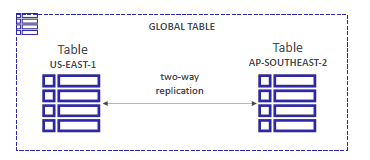
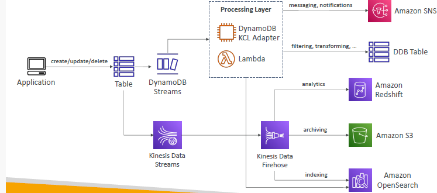

# Dynamo DB (NoSQL)
- serverless, Fully managed - maintenance/patching

---
## key points
- `highly available` : `multiple-AZs` replication
- `Scales` to massive workloads, distributed database.
  - Millions of requests per seconds, 
  - trillions of row, 
  - 100s of TB of storage
- `performance` 
  - Fast and consistent in performance , `single-digit millisecond`
- `security` 
  - Integrated with IAM for security, authorization and administration
  - encryption at rest/fly
- `storage Class` ( like in s3 ): 
  - Standard
  - Infrequent Access (IA) : to save more cost
- `DR` : 
  - automatic `backup` for last `35 days`
  - Enable Cross-region copy. no performace impact/ doentime.
  - point in time recovery
  - `export` (json,ion) data --> S3.
  - `import` (json,csv,ion) --> Dynamo DB
  - 

---  
## A. Global table :
  - table-1 (R/W) is `region-1`
  - table-1 (R/W) is `region-2`
  - `2 way replication` b/w both regions.
  - R/W from any region :_)
  - 
---
## B. DB funda + basic
  - table (Pk - `partitionKey` + `Sortkey`(optional) )
  - record(attributes) > item (single attribute) (`400 KB max`)
  - not fixed schema like rdbms. `schema/attributes can evolve rapidly`
  - Datatype: string, num, Bool,null + `list, Map, Set`
  - `TTL` : set expiration for record, it will auto-delete + send stream
    - eg: TTL is `2 hr`
    - webUser --> session 2 hr --> session logout --> cleanUp his/her data after 2 hr.
---
## C. capacity
  - `Provision` mode : `we` define RCU, WCU + autoScale:`y/n`
    - use case : predicated workload
    - this will help to optimize/lower cost.
  - `On-demand` mode : `workload` defines RCU, WCU automatically adjusted + autoScale:`y`
    - use case : un-predictable workload.
    - simplified billing but `expensive`
  ```
   RCU, WCU - measure `throughput` of read and write operations on a table.
   RCU - 2 read/sec upto 4KB/sec
   WCU - 1 write/sec upto 2KB/sec
  ```
---
## D. DAX
- `DyanamoDB Accelerator`
- 
- Dax vs ElastiCache.
- in memory cache, micro sec latency

---
## E. DynamoDB streams
- some usecase:
    - `React` to changes in real-time by invoking `lambda`,` KCL-adaptor(Java-App) `
    - Real-time usage `analytics` : send stream to `AmazonShift`
    - Implement cross-region `replication`
- 
- 

---
## F. demo :
```
- create db - no such thing :_)
- create table-1
    - choose : partition key (hash value used to retieve from table)
    - choose : sort key (optianal)
- capacity:
    - a. on-demand: simple, expensive 
    - b. Provision ** 
        - RCU
            - option-1 (scale-on) min-1 , max-100 , 70% utlization
            - option-2 (scale-off) capicity: 1
        - WCU
            - option-1 (scale-on) min-1 , max-100 , 70% utlization
            - option-2 (scale-off) capicity: 1
- indexing : pending
- Encryption (3 key options ) : dynamoDB-ownedKey, AWS-KMS, customerKey

- create item/record
    - record-1 : add attribute1,2,3,4    
    - record-2 : add attribute1,2
    - no schema :)    
```

