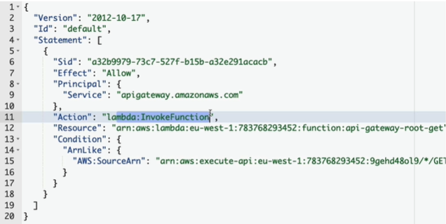

# API gateway
- > Client --> cname/alias(in R53) --> API gateway (Http/s,webSocket) --> XXXXX
  - lambda
  - on premAPI-API
  - ALB
  - Any `AWS service`.  eg: `S3:GETObject`
  - `VPC endPoint` (access AWS service from VPC_
  
---  
## A. deployment model
  - `edge-optimized` (default)
    - deployed in many region
    - backed by : cloudFront,CDN, edge-location
    - for global user
  - `regional`
    - deployed in single region eg: us-west-1
  - `private`
    - in private VPC
    - Also, VPC endpoint(interface) --> API gateway --> XXXXX
  - `regional with CloudFont`
    - set-1: for us-west-1
    - UNION
    - Set-2 : create CF distribution-1 (CF) : whiteList - europe user + india user
---
## B. Security:
- IAM role, OIDC and OAuth2
- `cognito` ?
- https/TCL with ACM 
  - keep certificate it `us-east-1` for global deployment model.
---
## C. Key feature
- `import` from Swagger/OpenAPI to define API.
- `transform` req/resp
- `cache` response
- API versioning
- diff env support ?
- `rate limiting` , `throttling`

---
## D. Use case
- 
- 

---
## E. Demo
```
- create (4) : api-gateway-1
    - HTTP API , REST API ** , REST API (Private),  Web-scoketAPI, 
    - choose - REST API
    - API details:  
        - create new **
        - import frpm OPen/AI swagger
        - clone API
    - deplomnet model : regional 
        - region : us-east-1
    - integration Type: lambda
        - choose method: lambda-fn-1
    - set timeout : default 30 s
    - check lambda > permission > "resource based policy statemnet" (policy/statemnet auto added)
        principle:api-gateway
        Action:lambda-Invoke
        resource:arnofLambda-1
        effect:allow
        condtion > sourceArn: api-gateway-1 
    - test from UI
    - Deploy API
        - will get invoke URL
```

