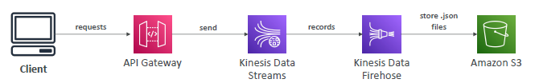

# API gateway
- > Client --> cname/alias(in R53) --> API gateway (Http/s,webSocket) --> XXXXX
  - lambda
  - on premAPI-API
  - ALB
  - Any AWS service API. eg: `S3:GETObject`
  
---  
## A. deployment model
  - `edge-optimized` (default)
    - backed by : cloudFront,CDN,edge location
    - for gobal user
  - `regional`
    - for us-west-1 user only
  - `regional with CloudFont`
    - set-1: for us-west-1 user only
    - UNION
    - Set-2 : create CF distribution-1 : whiteList - europe user + india user
  - `private`
    - used with in VPC
    - VPC endpoint - interface/gateway
---
## B. Security:
- IAM role
- `cognito` ?
- https/TCL with ACM 
  - keep certificate it `us-east-1` for global deploymnet model.
---
## C. Key feature
- `import` from Swagger/OpenAPI to define API.
- `transform` req/resp
- `cache` response
- API versioning
- diff env support ?
- `rate limiting` , `throttling`

---
## D. Use case
- 
- 
