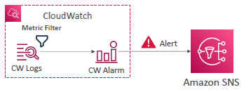

# Cloudwatch

## A. Cloudwatch : Metric 
- variable to monitor, some thing on service. 
  - eg: cpu utilization for ec2
- each metric belongs to `namespace`/group
- all service has > `some metric` >  metric has upto 30 attribute(`dimension`)
- can create 
  - `dashboard of metric`
  - `custom metric` on any service.
- can `stream` metric data to:
  - kinesis Data firehose, KDF -> ...
  - 3rd party : `datadog, splunk, dynatrace`


---  
## B. Cloudwatch : logs
### Key terms
- log `expiration` policies (never expire, 1 day to 10 years…)
- logs are `encrypted` by KMS
- `log-insight`: query engine, insight multiple log-group from same/`diff` acct too.

- `log-group` > `log-instance-1/2/3/...` 
  - create `log-metric-filter`, `Logs-streams`
  - eg: log-metric-filter - search pattern1 in log, if occurs, capture some value, say 100.

- log:Source --> CW:log --> **send**  -->  with/without log-metric-filter --> destination --> S3, KDS, KDF, lambda, OpenSearch
  - for S3, (`CreateExportTask`, take up 12 hr, not real-time)

- log:Source --> CW:log --> **subscribe** --> subscription-filter(destination),max=2 --> `log-stream` --> KDS, KDF, lambda, OpenSearch
  - can aggregate multiple log streams
  - create cross account subscription.
  - aggregate log streams + cross account subscription. eg:
    - aws1:log-group-1: `subscription filter-1-lg1` --> logs-stream-1  --> destination-1
    - aws1:log-group-1: `subscription filter-2-lg1` --> logs-stream-2  --> destination-1
    - `aws2`:log-group-2: `subscription filter-1-lg2` --> logs-stream-3  --> destination-1
 

- `log:Source`
  - `application`: ECS, Lambda, Beanstalk
  - `network` : VPS flow-logs, R53, API-gateway
  - `cloudTrail`
  - `program and agent`
    - SDK 
    - CW: `log-agent` : collects only logs
    - CW: `unified-agent` -->  log + metric(ram.cpu.etc - at `granular` level) .
      - run on `ec2-i` + `on-prem vms` 
      - have centralized config for all-agent in `SSM-parameter store`.
      - eg: (metric)
        - **CPU** (active, guest, idle, system, user, steal)
        - **Disk metrics** (free, used, total), Disk IO (writes, reads, bytes, iops)
        - **RAM** (free, inactive, used, total, cached)
        - **Netstat** (number of TCP and UDP connections, net packets, bytes)
        - **Processes** (total, dead, bloqued, idle, running, sleep)

---
## C. Cloudwatch : alarm  
- trigger notifications for any metric
- `state` : ok, in-alarm, insufficient-data
- action : stop,reboot,recover ec2, asg, sns, etc.
- `composite alarm` alarm1 AND/OR alarm2
- alarm can be created on :
  - metric
  - logs
  


---
## D. demo
```
- create lambda 
- run multiple time
- lambda "log-group-1" created :
    - log instance-1
    - log instance-2
    
// actions on  log-group-1 :
// 1. export to s3

// 2. create subscription-filter (max=2)
- KDF
- S3

// 3. create metric-filter on log-group-1
log-group-1 > metric-filter tab
    - name: filter-1
    - namespace: filter-namespace-1
    - filter pattern : "error"
    - metric value : 100
    - so, when error found in metric will occur with value 100
    
// 4 . create log-stream-1 from log-group-1 > start live tail

// 5 . create alarm
- launch ec2-i1 
- CW > create metric-1
  - add ec2-i1
  - type : cpu
  - every 5 min, 3 of 3
  - greater than 90%
  - state action:
    - ok > action:
    - in-alarrm > action : terminate ec2-i1
    - insufficient-data > action :
     >> manually update state from aws-cli
    
...

```
---
##  Z. screenshots
- Logs streams


