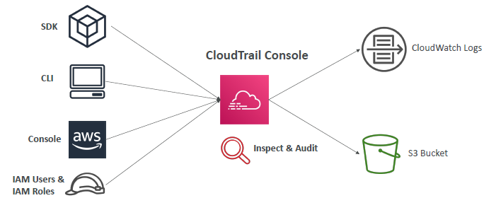
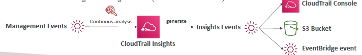
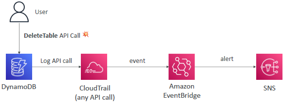
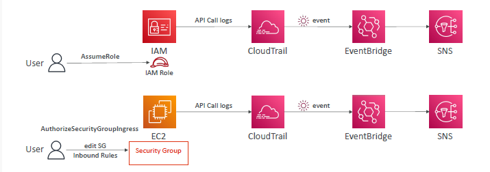

# Cloudtrail / CT
- Provides governance, compliance and audit for your AWS Account.
- enabled by default
- `ALL Account logs and events` are captured here, with 90 days default retention.
  - eg: DynamoDB table create API called --> logged in CT + event sent to `eventBridge`,
  - similar endless API calls. 
  - change extend  retention day, but move logs to s3 > athena.
- use it for any `investigation`

---
## Cloudtrail : events
- `Management Events` (on)
  - Operations on **resources**
  - eg:
    - Configuring security (IAM AttachRolePolicy)
    - Configuring rules for routing data (Amazon EC2 CreateSubnet)
    - Setting up logging (AWS CloudTrail CreateTrail)
  - Can `separate`:
    - Management `Read` Events (don’t modify resources) 
    - Management `Write` Events
  
- `Data Events` (on/off)
  - Operations on **resources data**
  - eg: Amazon `S3 object-level activity` (GetObject, DeleteObject, PutObject,etc)

- `insight Events` (on/off)
  - Management-Events -->  `CT:Insight > (analyze and generate)` --> insight-Events
  - event for `unusual activity`.
  - eg: 
    - inaccurate resource provisioning
    - hitting service limits
    - Bursts of AWS IAM actions
    - Gaps in periodic maintenance activity
  - 

---

