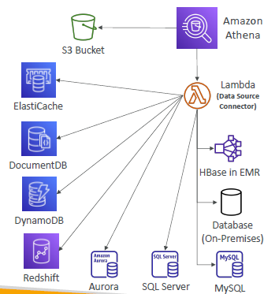

# Athena (serverless)

- pay for data Scan : `$5/TB`

- `source` --> Athena (`scan and query data using SQL`) --> result --> `S3` and `Amazon QuickSight` (dashboard)
- sources:
  - `S3(object)`:csv,json,avro,`parquet`, 
    - vpc-logs,elb-logs, cloudtrail, goes to s3, can be analyzed.
    - organize data in S3 like `/year/month/day/hr/...`
    - so it will query specific object. fewer data will be scanned === cost reduce.
    - more cost saving : use `compressed` + `columnar` data
  - `on-prem/aws:database` (relational/NoSQL) --> etl/`aws-glue` --> parquet
  - `kineses data steam`
  - `Data Source Connector`
    - AWS `Lambda` to run Federated Queries on RDS,CW,DynamoDB,etc
    - if don't want to write etl.glue. so with this option.

- demo:
```
- bucket-1 >  enable s3-access log.
- copy location-1

athena:
    - create data_source-1
    - Query editor
        - run : create DataBase db1;
        - get query from internet, to DDL/DML to get se-access-log into tables.
        - edit query with location-1.
        - run query to perform ddl and dml, table created : bucket-1_logs
        - check L select * from database-1.bucket-1_logs limit 10.
        - query more standard sql and see report.

 more:
 - recent queries
 - saved queries - also encrypted result.   
```


