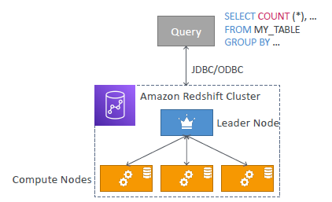
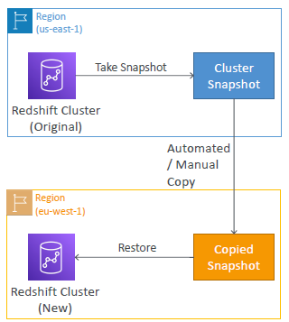

# Redshift
- **Not serverless**

- `OLTP` (online analytic processing)
- Analytics and data warehousing
- scale to `PB od data`
- integrated with `Amazon Quicksight` or `Tableau`

- `10x performance `than other data warehouses and athena
  - parallel query engine : 
    - **Cluster** : `leader Node > compute Node `
    - `provision nodes(ec2-i)` in advance.
    - reserve instance for cost-saving
  - Columnar storage ? 
  - indexes
  - faster-joins and `faster-aggregation`

---
## Redshift : DR
- single AZ by default
- cross az-replication : enable `Multi-AZ`  
- cross region replication
  - `incremental-snapshot`(only new change), in every in every 8 hr. retention: 35 days.
  - stored in s3.
  - restore snapshot/s into new region : **manually/automate**.
  - 

--- 
## Redshift : Load Data
- sources
  1. kinesis Data stream --> `kinesis FireHore` --> Redshift
  2. s3 --> Redshift
  3. program(Java:SDK): `in-batches` --> Redshift

---
## Redshift : query from S3 > Spectrum
- **Cluster** : `leader Node > compute Node > 1000s of spectrum`

