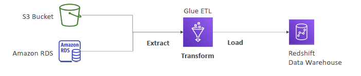
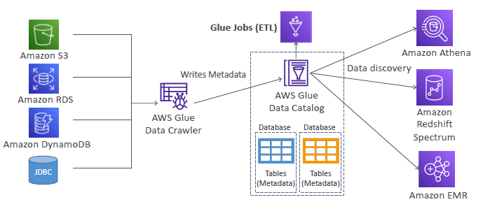

# Glue (Serverless , ETL)

## Use case
- #1. transform data before loading to `redshift` data warehouse

---
- #2. transform `csv to parquet` (columnar format,faster for analysis) --> for `athena`
- very common

---
## Glue Components
- Glue `Data catalog` : metadata
- Glue `Data Crawler` : scan source and create help to create metadata.

---

## Glue : keypoint
- ` ** Glue Job Bookmarks ** ` : prevent re-processing old data
- `Glue Elastic Views`: virtual table.
- `Glue DataBrew`: clean and normalize data, using pre-built transformation
- `Glue Studio`: new GUI to create, run and monitor ETL jobs in Glue
- `Glue Streaming ETL` :
  - built on `Apache Spark Streaming`
  - compatible with 
    - Kinesis Data Streaming 
    - Kafka