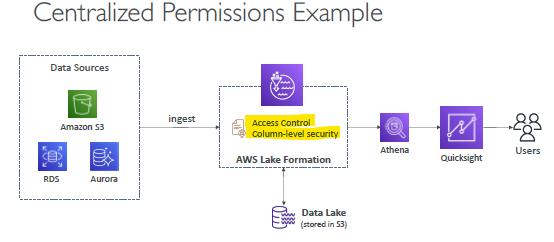

# Lake Formation (Fully managed)

- build on top of `AWS glue`
- `central place` to have all your data for analytics purposes.
- `Collects` all data for analysis and provides `Fine-grained` Access (row and column-level) 
- Also `centralized access` for all other analytics related services at single place.
- It `automates` many complex manual steps :`collecting (into s3), cleansing, moving, cataloging data,de-duplicate (using ML Transforms)`, etc
  - Combine structured (RDS,csv,etc) and unstructured data in the data lake
  - Out-of-the-box `source blueprints` for S3, RDS, Relational & NoSQL DB…

