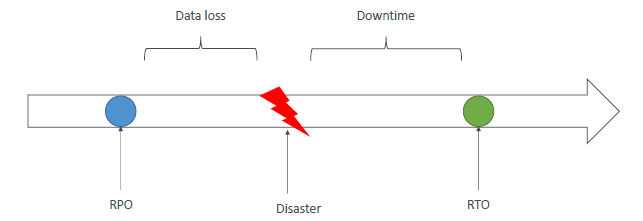
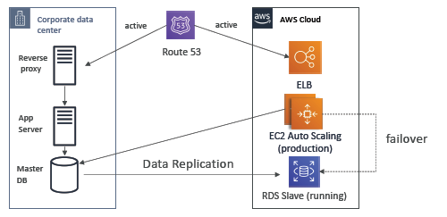

# DR
- D : event that has a negative impact on a `company’s business continuity` or `finances`
- DR : `preparing` for and recovering from a disaster.
  - On-premise => On-premise
  - On-premise => AWS Cloud: hybrid recovery
  - AWS Cloud `Region A` => AWS Cloud `Region B`
---
## A. Key terms
- `RPO`: Recovery `Point` Objective
  - taking backup in one hr, so if D happens, then can take restore from backup/point taken an hr ago.
  - so rpo is 1hr here.
  - 1 min is expensive than 1 hr
  
- `RTO`: Recovery `Time` Objective
  - D happened, it took 2 hour to recover.
  - there was downtime of 2 hr
  - 15 min is expensive than 2 hr.
  
- `low` RPO/RTO === `expensive`

---
## B. `Strategies` to optimize RPO/RTO

### B.1 backup / restore
- DB:
  - RDS (single-region) --> 1hr --> backup/snapshot --> S3(not directly accessible) in  same region (az-1 and az-2)
  - DR happens > az-1 goes down.
  - recreate infra using IAC + R53
  - or recover db from s3 snapshot (az-2 must have it)
  - if region has outage.
    - use cross region replication for rds
    - or use Aurora --> have read Replica/s in other region 
    - or use global aurora -->  have read Replica/s in other region ( < 1 sec)
    - and promote aurora read replica as primary in DR.
- have your IAC ready, run it on DR
- code/app deploy : take AMI + docker images
- RTO is high, since getting up whole thing from scratch.
- RPO is 1hr here.

### B.2 Pilot light
- A `small version of the app` (critical business) is always running in the `cloud` in `standby`.
- update r53 to switch.
- restore rest.

### B.3 warm light
- `Full` system is up and running, but at `minimum size`
- Upon disaster, scale to `production load`

### B.4 multi site
- active - active
- Full Production Scale is running AWS and On Premise
- on D, it will inactive - active.
- no recovery need to do.
- RTO is in second/min
- expensive

---
## C. DR tips
- same we have learnt so far. nothing new.

- `Backup`
  - EBS Snapshots, RDS automated `backups` / Snapshots, etc…
  - Regular pushes to S3 / S3 IA / `Glacier`, Lifecycle Policy, `Cross Region Replication`
  - From On-Premise: `Snowball` or `Storage Gateway`
  
- `High Availability`
  - Use `Route53` to migrate DNS over from Region to Region
  - RDS `Multi-AZ`, ElastiCache Multi-AZ, EFS, S3
  - `Site to Site VPN` as a recovery from `Direct Connect`
  - Use `ASG`, ALB

- Automation
  - `CloudFormation` / Elastic Beanstalk to re-create a whole new environment
  - `Reboot EC2 instances` with CloudWatch if alarms fail
  - AWS `Lambda`  to automation to build infra, etc
  - `IAC` / terraform

---
