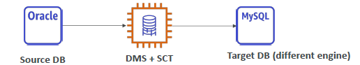
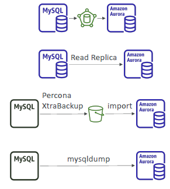

# A. SCT
- schema conversion tool, can install on op-prem devices.
- for heterogeneous migration, only
- eg: fssrr : oracle --> SCT --> Postgres/aurora
- 

---

# B. DMS  
- supports : `homo` + `hetero(with SCT)`
- concept
  - on prem db (large) --> offline : snowball --> aws cloud
  - on-prem-db --> `online : run DMS on EC2` --> aws cloud
    - `Serverless` option also there.
---  
## DMS : source
  - `on-prem` : db ( Oracle, MS SQL Server, MySQL, MariaDB, PostgreSQL, MongoDB, SAP, DB2)
  - `azure` : sql-db
  - `aws`:
    - ec2 : db  ( Oracle, MS SQL Server, MySQL, MariaDB, PostgreSQL, MongoDB, SAP, DB2)
    - rds
    - aurora
    - s3
    - DocumentDB
---  
## DMS : targets
  - `on-prem` : db ( Oracle, MS SQL Server, MySQL, MariaDB, PostgreSQL, SAP)
  - `aws`:
      - ec2 : db ( Oracle, MS SQL Server, MySQL, MariaDB, PostgreSQL, SAP)
      - rds
      - aurora
      - s3
      - DocumentDB
      - neptune
      - redis
      - DynamoDB 
      - `analytic and stream kind`:
        - Kineses Data stream
        - Apache kafka
        - OpenSearch Service ?
        - Redshift ?
--- 
## network perspective
- Transferring large amount of data into AWS, from `network perspective`
  - Over the `internet` / Site-to-Site VPN:
  - Over `direct connect `1Gbps
  - Over Snowball `offline`

---  
## DMS : Continuous replication
- use SCT and DMS
- also `enable multi-zone` on target db


--- 
## demo
```
// 1. DMS - `enpoints`
- endpoint-1 to connecto source DB
- endpoint-2 to connecto target DB

// 2. DMS - `replication-instance`
  - choose starting point:
    - discover and access
        - give roadmap, 
        - generate path in few hrs
    - convert
        - for hetero, use sct
        - takes weeks
    - migrate
        - choose:
            - instance-based (mamge/admins ec2) **
                - provision ec2 intance
                - DMS version
                - single-az/multi-az : az replication
                - storage for ec2
                - network
                - maintence window
            - serverless (no admin, migrated + replicates)
                - EASY

// 3. DMS `replication-task`
- create task-1
    - choose source endpoint
    - choose target endpoin
    - choose replication instance 
        - task setting : { json } - update it
           
```

---
## scenario
- #1 RDS(`mySQl`)  --> migrate(no DMS) --> Aurora(engine:`mySQL`)
  - option-1: RDS > `rds::snapshot` > s3 > restore > Aurora
  - option-2: aurora > create `read-replica from RDS`  > promote it.

- #2 ext-mysql --> migrate(no DMS) --> Aurora(engine:`mySQL`)
  - option-1 : ext-mysql > `percona-mysql-tool`:`backup` > s3 > restore > Aurora
  - option-2 : ext-mysql > `dump-util`  > restore dumps > aurora : SLOW (no s3)
  


- #3 RDS(`postgres`)  --> migrate(no DMS) --> Aurora(engine:`postgres`)
  - option-1: RDS > `rds`         :`snapshot` > s3 > restore > Aurora
  - option-2: aurora > create `read-replica` from RDS  > promote it

- #4 ext-postgres --> migrate(no DMS) --> Aurora(engine:`postgres`)
  - option-1 : RDS > `backup-tool`:`backup` > s3 > import(`aws_se_aurora extension`) > Aurora

