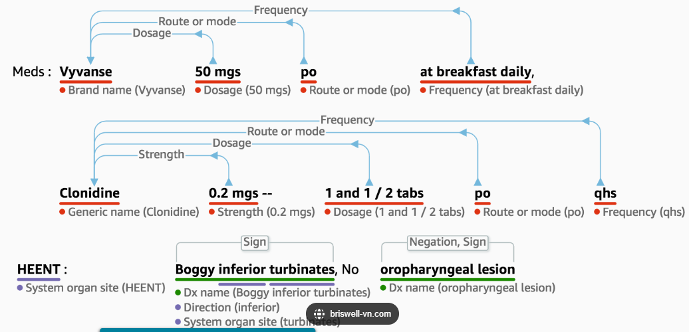

# MS services
## A. Amazon Rekognition
- Find objects, people, text, scenes in `images and videos`
- Face Detection and analysis
- Celebrity Recognition
- path analysis/ pathing : eg: soccer game (video), sports game analysis
- `Content Moderation` 
  - safer user experience by remove racist, etc offensive content
  - flag them manual review.
  - set `Minimum Confidence Threshold` flagged item

---
## B.1 Amazon Transcribe
- speech --> text, uses `ASR`(automatic speech recognition/deep ML)
- Automatically remove Personally Identifiable Information `(PII)`
- Automatic `Language Identification`
- use case: 
  - transcribe customer service calls
  - captioning and subtitling

---
## B.2. Amazon polly
- speech <-- text

- upload `lexicon` and synthesis speech operation. eg:
  - Stylized words: St3ph4ne => “Stephane”
  - Acronyms: AWS => “Amazon Web Services”
  
- uses `SSML` for customization, usecase:
  - ssml : Speech Synthesis `Markup Language`. 
    - > <speak> hello <break time="3s"> lekhraj. </speak>
  - `emphasizing` specific words or phrases
  - `phonetic pronunciation`
  - including `breathing sounds, whispering`
  - using the `Newscaster speaking style`
  
---
## C. Amazon Translate
- language translation.

---
## D. Amazon Connect
- same, its `Alexa` using ASR bts 
- + better natural language understand.
- use case: built `chat-bots`
- integrate with `CRM` (customer relation management system)
- 

---
## E. Amazon Connect
- cloud-based `virtual contact center`
- Receive calls, create contact flows
- 80% cheaper

---
## F.1 Amazon Comprehend (serverless)
- `NLP`, Natural Language Processing ( with more detailed analysis )
- find `insights and relationships` in text
  -  `Language` of the text
  -  Extracts : `key-phrases, places, people, brands, events`
  -  Understands `how positive or negative` the text is
  -  `Analyzes` text using tokenization and parts of speech
  -  Automatically `organizes` a collection of text files by `topic` / article

---
## F.2. Amazon Comprehend Medical (serverless)
- uses `NLP` only to detect `PHI` (Protected Health Information), eg:
  - Physician’s notes
  - Discharge summaries
  - Test results
  - Case notes
- create `strtutured` notes/graph, with related links
- 