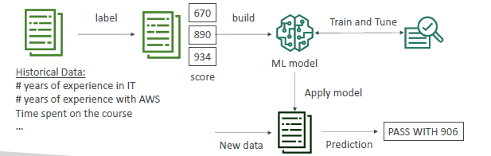

# ML service 2
## A. For developers

### A.1 Amazon `SageMaker` 
- Fully managed service for `developers / data scientists` to build `ML models`
- label > build model > train > apply model ,etc
- eg : predict exam score
- 

---

### A.2 Amazon `Personlize` 
- builds `real-time personalized recommendations` api
- Implement in days
- don’t need to build, train,and deploy ML solutions
- 