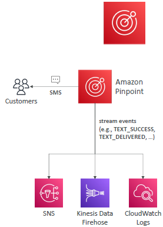

# Other Service : sms and email related

## Amazon `SES` (Simple Email Service)
- Fully managed service
- `Flexible IP` deployment.
- send emails `globally at scale`
- Usecase: transactional, marketing and bulk email communications
- send emails `securely`, supports:
  - `DKIM` (DomainKeys Identified Mail)
  - `SPF` (Sender Policy Framework)

---
## Amazon `pinpoint`
- `next level SMS`, Also support email, in-app messaging.
- Usecase: run `campaigns` by sending marketing, bulk,transactional SMS messages.
- features :
  - Scalable 2-way; receive replies
  - create message templates, 
  - create delivery schedules, 
  - highly-targeted segments, and full campaigns
  - `stream events` to other service (KDF, SNS, CW)
  - 