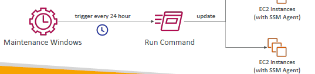
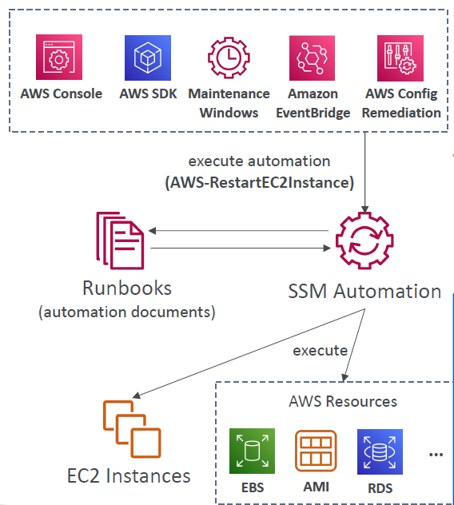

# 1. SSM (System Session Manager)
- 3 ways to connect to ec2-i
  - ssh
  - ec2 instance connect
  - ssm
- no SSH needed / secure alternative to ssh
- launch ec2-i1(window/Linux/mac) and attach AmazonSSmManagedIntanceCore policy. 
  - this will make `SSM agent`, active on ec2-i1.
- 
- `FleetManager` service> managedNode > view :: all EC2 instance managed by SSM
  - start session
  - launch blank terminal window : secure shell
  - run any command.
  - once closed, check session history.
  - Also, it sends session log data to `S3/CW`

---
# SSM - other related/linked services
## 2. Systems Manager - `RunCommand`
- execute cmd/script across multiple ec2-i/s
- Integrated with `IAM & CloudTrail`
- output:
  - log: `s3/Cw`
  - error : `sns`
- trigger : user/manually + [ eventBridge > event > runCommand ]
- 

---
## 3. Systems Manager - `Patch Manager`
- automate : OS updates, applications updates, security updates on multiple ec2-i/s(Linux, macOS, and Windows)
- `on-demand` or schedule/maintenance-Window
- 

---
## 4. Systems Manager - `maintenance Window`
- has:
  - Schedule
  - Duration
  - Set of `registered instances`
  - Set of `registered tasks`
- 

---
## 5. Systems Manager - `Automation`
- Automation documnet - `Runbook`, define actions:
  - restart instances, 
  - create an AMI, 
  - EBS snapshot
  - etc
- trigger runbook:
  - Manually using AWS Console, AWS CLI or SDK
  - Amazon EventBridge
  - schedule/Maintenance Windows
  - `AWS Config` (remediation rule)

