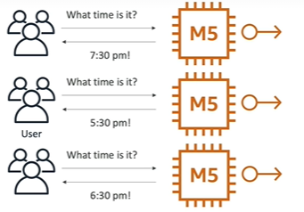
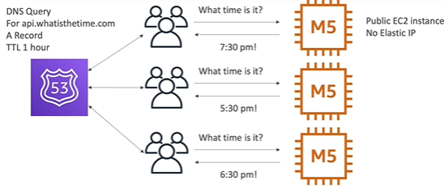
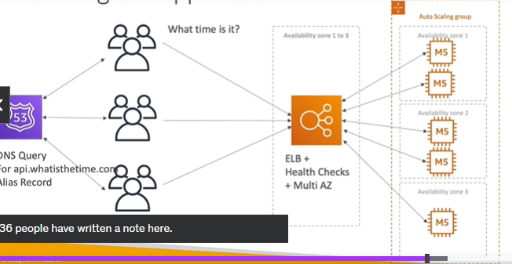

# SSA Discussion

## A. Time App (stateless)
- launch time app on Ec2 (t1.micro) in Az-1
- give current time
---
### `Problem-1`:  need static/fixed Ip 
  - assign `elastic IP `(paid)
  - 
---
### `Problem-2 `: more user more traffic. increase computing capacity.
  - `vertical scale` to m5, having downtime as well.

### `problem-3` : even more traffic, scaling but no downtime
  - `horizontal scaling` : 2 more m5.
  - launch 3 m5 intances in Az-1 + attach elastic Ip/s.
  - 
---
### `problem-4` : Soo many elastic IP.
  - r53 > add a-record (with ttl) with `dns` name with service::ec2::ec2-i1/2/3
  - 
---
### `problem-5` : ec2-i health issue and went down.
  - add `ALB` in same AZ-1 + health check
  - update sg of ec2-i and alb for allowed traffics.
  - allow traffic from alb for security purpose.
  - 
---
### `problem-6` : traffic is less, scaling down
  - add `ASG` > deploy in az-1, can span over Az/s too. add min.max.desired
  - az-3::ec-2i3 -- `reserve instance`
  - 
  - 
---
### `problem-7` : Availability issue / DR
  - deploy` app/ec2-i` in multiple AZ / az-1, az-2, az-3
  - deploy `ALB` in multiple AZ  / az-1, az-2, az-3 
  - 

