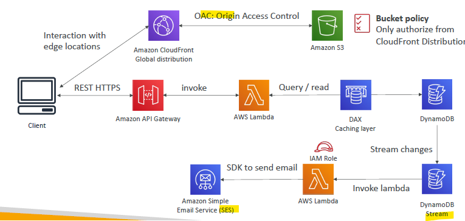
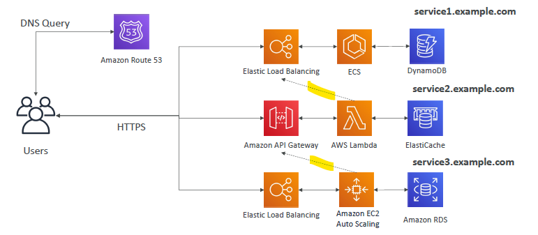
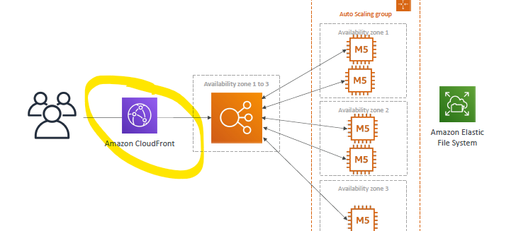

# SSA Discussion

## A. TodoList App (Serverless)
- REST : web-client -->  upload/dowload > s3
- serverless Authentication : `cognito` --> api-gateway
- scalable DB with high READ throughput : `DynamoDB`

### Problem-1 : serverless auth to api-gateway
- use cognito:user-pool

### Problem-2 : serverless auth to s3
- web-client --> s3 or directly to s3
  - authenticate with cognito:user-pool
  - exchange auth token for access-token / temp AWS credential
  - use token to access s3

### Problem-3 : reduces cost for DynomoDB, since not too much write.
- use DAX
- or use API-gateway cache feature.

---

## B. MyBlog-App (Serverless)
- blogs : more READs, less Write
- globally scale website (static files)  : `CF`, `S3 static Hosting`,
- photo upload > thumbnail : `lambda`
- welcome email : Lambda --> `SES`

---

## C. Microservice
- Not best, but AWS solves some problem:
- see mix of three different types.
- ms1 --> ms2 : `sync` pattern.
- ms1 --> SQS/KDS --> ms2  : `A-sync` pattern

---

## C. Software Off-loading
- myApp --> new version / update came.
- globally everyone downloading update from our app.
- need to optimize ASG to handle sudden request spike ?
- better way just put `CF in front of ELB`
- since update is static file, cache it to CF
- And CF will scale to handle global requests.
- this is cheap option too.

