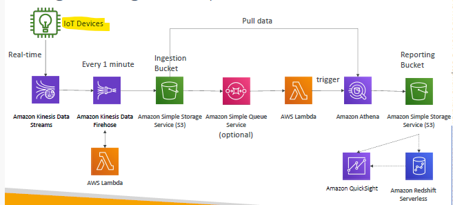

## Big Data Ingestion Pipeline

### A. Sample architecture

- `IoT Core` allows you to harvest data from `IoT devices`
-  `Kinesis` is great for **real-time data collection**
-  `Firehose` helps with data **delivery** to S3 in near real-time (1 minute)
-  `Lambda` can help Firehose with data **transformations**
  -  `S3` can trigger notifications to `SQS` --> `Lambda` can subscribe to SQS
-  `Athena` is a serverless SQL service and `results` are stored in S3
-  The reporting S3 bucket contains analyzed data and can be used by reporting tool such as `AWS QuickSight`, Redshift/OLAP, etc…