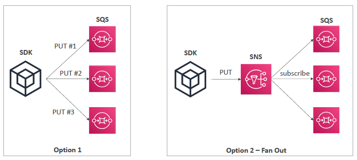
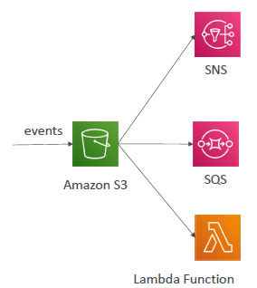
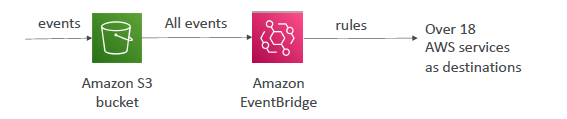
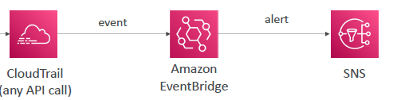

# SSA Discussion

## Architecture 
### 1. SQS, SNS and lambda with DLQ
- after retry, move to DLQ
- 

### 2. SQS SNS : Fan-out pattern
- 

### 3. S3 event
- 

### 4. event bridge and event rules
- rule give advance filter options
- can combine/have multiple rule and multiple targets
- `Archive`, `Replay` Events
- 

### 5. CT log/event

### 6. more-1

