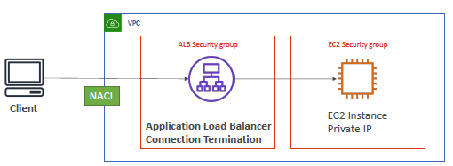
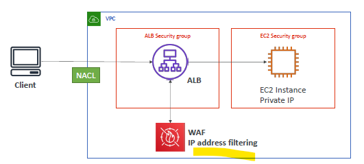
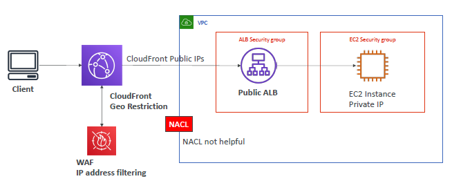

# SSA Dicussion

## A. Block IP to ec2-i
### 1. NACL 
- use VPC/subnet `ACL` : allow/deny rule(rule-priority)
- block a specific IP.
- 

### 2.1. Allow traffic from ALB only
- Again ACL has already blocked IP
- 

### 2.1. Allow traffic from ALB only + WAF

### 3. CF with geo-restriction + WAF
